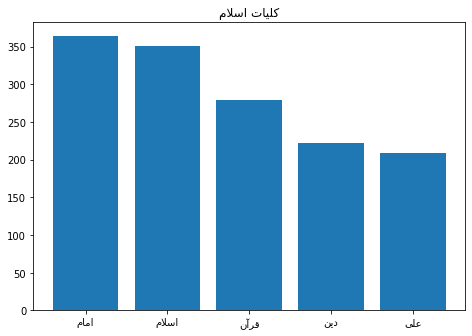

<h1><center> Artificial Intelligence Computer Assignment 3</center></h1>
<h2><center> Sepehr Ghobadi / Student No: 810098009 </center></h2>


```python
import numpy as np
import pandas as pd
import matplotlib.pyplot as plt
from bidi.algorithm import get_display
from arabic_reshaper import reshape
import csv, copy, math, shutil,random
from hazm import Normalizer, Stemmer, Lemmatizer, utils, word_tokenize
from nltk import RegexpTokenizer, download
from nltk.corpus import stopwords as nltk_stopwords
from nltk.tokenize import word_tokenize as nltk_word_tokenize
from IPython.display import display, HTML
CSS = """
.output {
    align-items: center;
}
"""
HTML('<style>{}</style>'.format(CSS))
```


<style>
.output {
    align-items: center;
}
</style>


# Aim of Project

In this project, we apply the Naïve Bayes classifier for categorizing six types of books based on their title and description. The methodology and codes are all explained throughout this report and the effect of several related parameters and techniques are discussed.

# 1. Dataset

The train dataset consists of about 2550 books and their relative information including "**title**", "**description**", "**category**" and test dataset contains information of 450 books that our model will classify them in test stage and compare the result with real category of test books.


```python
train_data = pd.read_csv('./books_train.csv')
test_data = pd.read_csv('./books_test.csv')
```


```python
train_data.groupby(['categories']).count()
```


<div>
<table border="1" class="dataframe">
  <thead>
    <tr style="text-align: right;">
      <th></th>
      <th>title</th>
      <th>description</th>
    </tr>
    <tr>
      <th>categories</th>
      <th></th>
      <th></th>
    </tr>
  </thead>
  <tbody>
    <tr>
      <th>جامعه‌شناسی</th>
      <td>425</td>
      <td>425</td>
    </tr>
    <tr>
      <th>داستان کوتاه</th>
      <td>425</td>
      <td>425</td>
    </tr>
    <tr>
      <th>داستان کودک و نوجوانان</th>
      <td>425</td>
      <td>425</td>
    </tr>
    <tr>
      <th>رمان</th>
      <td>425</td>
      <td>425</td>
    </tr>
    <tr>
      <th>مدیریت و کسب و کار</th>
      <td>425</td>
      <td>425</td>
    </tr>
    <tr>
      <th>کلیات اسلام</th>
      <td>425</td>
      <td>425</td>
    </tr>
  </tbody>
</table>
</div>


The first 10 rows of the train labeled data are as follow:


```python
train_data.head(10)
```


<div>
<table border="1" class="dataframe">
  <thead>
    <tr style="text-align: right;">
      <th></th>
      <th>title</th>
      <th>description</th>
      <th>categories</th>
    </tr>
  </thead>
  <tbody>
    <tr>
      <th>0</th>
      <td>ساختار نظریه‌های جامعه‌شناسی ایران</td>
      <td>«ساختار نظریه‌های جامعه‌شناسی ایران» نوشته ابو...</td>
      <td>جامعه‌شناسی</td>
    </tr>
    <tr>
      <th>1</th>
      <td>جامعه و فرهنگ کانادا</td>
      <td>«جامعه و فرهنگ کانادا» از مجموعه کتاب‌های «جام...</td>
      <td>جامعه‌شناسی</td>
    </tr>
    <tr>
      <th>2</th>
      <td>پرسش از موعود</td>
      <td>پرسش‌های مختلفی درباره زندگی و شخصیت امام مهدی...</td>
      <td>کلیات اسلام</td>
    </tr>
    <tr>
      <th>3</th>
      <td>موج، دریا</td>
      <td>«موج دریا» به قلم مهری ماهوتی (-۱۳۴۰) و تصویرگ...</td>
      <td>داستان کودک و نوجوانان</td>
    </tr>
    <tr>
      <th>4</th>
      <td>پرسش از غرب</td>
      <td>«پرسش از غرب» به قلم دکتر اسماعیل شفیعی سروستا...</td>
      <td>جامعه‌شناسی</td>
    </tr>
    <tr>
      <th>5</th>
      <td>خارج از خط</td>
      <td>«خارج از خط» مجموعه داستان کوتاهی نوشته محمود ...</td>
      <td>داستان کوتاه</td>
    </tr>
    <tr>
      <th>6</th>
      <td>لاک صورتی</td>
      <td>«لاک صورتی» نوشته جلال آل احمد(۱۳۴۸-۱۳۰۲) نویس...</td>
      <td>داستان کوتاه</td>
    </tr>
    <tr>
      <th>7</th>
      <td>راهبردهای سرمایه گذاری کسب و کار</td>
      <td>راه‌های بسیار زیادی برای سرمایه‌گذاری در دنیا ...</td>
      <td>مدیریت و کسب و کار</td>
    </tr>
    <tr>
      <th>8</th>
      <td>تحلیل گفتمان و نظرات رسانه‌های بریتانیا: چهره‌...</td>
      <td>با شکل‌گیری و رشد روز افزون دهکده جهانی، بشر ب...</td>
      <td>کلیات اسلام</td>
    </tr>
    <tr>
      <th>9</th>
      <td>رویکردی جدید به اختلالات مصرف مواد و مشاوره‌ی ...</td>
      <td>«رویکردی جدید به اختلالات مصرف مواد و مشاوره‌ی...</td>
      <td>جامعه‌شناسی</td>
    </tr>
  </tbody>
</table>
</div>


# 2. Preparing the Dataset

## 2.1 Bag of Words Model

The bag of words model is a very common feature extraction procedure for sentences and documents. In this approach, we look at the histogram of the words within the text, i.e. considering each word count as a feature. It is called a "bag" of words as any information about the order or structure of words in the document is discarded and the model is only concerned with whether known words occur in the document, not where in the document.

As was discussed, the bag of words model deals with individual words in a text. Therefore, in the beginning, each book's title and description are splitted into its words.

Some sources of irrelevancy exist in descriptions and for increasing the performance of the algorithm, it is important to remove or at least reduce these sources. In the two next sections, we will discuss different sources of irrelevancy and ways for removing them from the descriptions.

## 2.2 Irrelevancies in  Books' Title and Description

An important fact to deal with is the irrelevancies in descriptions. These irrelevancies my harder the task of classification for the algorithm as well as increasing the computational expenses. Three of the probable forms of irrelevancies are as follow:

1. **Stop Words**: Stop words are a set of commonly used words in any language. For example, in English, "the", "is", and "and" would easily qualify as stop words and in persian words like "به", "و", "از", ... can be flagged as stop words. In language text processing tasks, these frequent words would be removed as they usually appear in all kinds of texts regardless of their category and carry no useful information for classifying texts.


2. **Inflections**: For grammatical reasons, descriptions use different inflections of words. Despite their different appearance, inflections of a root word convey similar meanings. In the books classification problem, the classifier acts based on the similarity of words between a given instance and each class. Consequently, by reducing each word to its root form, the variety of words will decrease and the classifier is expected to perform better.


3. **Unknown Words**:  The words that occur in our test data but are not in our vocabulary at all because they did not occur in any training document in any class are unknonw words. The unknown word solution for such unknown words is to ignore them (remove them) from the test document and not include any probability for them at all

there are some other irrelevancies like difference of upper case and lower case characters that are not the case in models used on persian texts.
We will discuss the effect of removing each of the mentioned probable irrelevancies on the final performance of the algorithm.

### 2.2.1 Ways of Removing Irrelevancies <a id="Q1-1"></a>

Here, some methods are introduced for removing the discussed sources of irrelevancy in the previous section.

for finding the stop words in the descriptions, we need a set of Persian stopwords that can be provided form the utils module of **<a href="https://github.com/sobhe/hazm">Hazm Library</a>**. The stop words can easily be found and removed from the descriptions.


In the case of the inflections, there are two main methods for removing words inflections:

1. **Stemming**: Stemming is the process of reducing inflection in words to their root form such as mapping a group of words to the same stem even if the stem is not a valid word in the language.


2. **Lemmatization**: Lemmatization is the process of replacing words with their lemma (the base or dictionary form of a word) depending on their meaning.

Lemmatization, unlike Stemming, reduces the inflected words properly ensuring that the root word belongs to the language. In Lemmatization root word is called Lemma. A lemma (plural lemmas or lemmata) is the canonical form, dictionary form, or citation form of a set of words.

we will use both of the mentioned methods for removing the infection words and measure the effect of both on the final results of the classifier.

Both of the mentioned methods for dealing with infections are provided in the Hazm library.

### 2.2.2 Removing Irrelevancies form Titles and Descriptions


```python
def normalize_data(data, cols, stemming, lemmatization, filter_stop_words):
    normalizer = Normalizer()
    tokenizer = RegexpTokenizer(r'\w+')
    if filter_stop_words:
        stopwords = utils.stopwords_list()
    else:
        stopwords = []
    data_copy = copy.copy(data)
    result = copy.copy(data)
    for col in cols:
        normalized_data = [normalizer.normalize(data_copy[col][row]) for row in range(data_copy.count()[col])]
        if stemming:
            stemmer = Stemmer()
            normalized_data = [ [word for word in tokenizer.tokenize(stemmer.stem(row)) if word not in stopwords ] for row in normalized_data]
        if lemmatization:
            lemmatizer = Lemmatizer()
            normalized_data = [ [lemmatizer.lemmatize(word) for word in tokenizer.tokenize(row) if word not in stopwords] for row in normalized_data]
        result[col]=normalized_data
    return result;
```

now we normalize train and test dataset:


```python
normalized_train_data = normalize_data(train_data, ["title", "description"], lemmatization=True, stemming=False, filter_stop_words=True)
normalized_test_data = normalize_data(test_data, ["title", "description"], lemmatization=True, stemming=False, filter_stop_words=True)
normalized_train_data.head()
```


<div>
<table border="1" class="dataframe">
  <thead>
    <tr style="text-align: right;">
      <th></th>
      <th>title</th>
      <th>description</th>
      <th>categories</th>
    </tr>
  </thead>
  <tbody>
    <tr>
      <th>0</th>
      <td>[ساختار, نظریه, های, جامعه, شناخت#شناس, ایران]</td>
      <td>[ساختار, نظریه, های, جامعه, شناخت#شناس, ایران,...</td>
      <td>جامعه‌شناسی</td>
    </tr>
    <tr>
      <th>1</th>
      <td>[جامعه, فرهنگ, کانادا]</td>
      <td>[جامعه, فرهنگ, کانادا, مجموعه, کتاب, های, جامع...</td>
      <td>جامعه‌شناسی</td>
    </tr>
    <tr>
      <th>2</th>
      <td>[پرسش, موعود]</td>
      <td>[پرسش, های, مختلف, زندگی, شخصیت, امام, مهدی, ع...</td>
      <td>کلیات اسلام</td>
    </tr>
    <tr>
      <th>3</th>
      <td>[موج, دریا]</td>
      <td>[موج, دریا, قلم, مهر, ماهوت, ۱۳۴۰, تصویرگر, عا...</td>
      <td>داستان کودک و نوجوانان</td>
    </tr>
    <tr>
      <th>4</th>
      <td>[پرسش, غرب]</td>
      <td>[پرسش, غرب, قلم, دکتر, اسماعیل, شفیع, سروستان,...</td>
      <td>جامعه‌شناسی</td>
    </tr>
  </tbody>
</table>
</div>


# 3. Naïve Bayes Classifier

**Naïve Bayes classifiers** are simple probabilistic classifiers based on **applying Bayes' theorem with strong independence assumptions** between the features. They are among the simplest Bayesian network models.


Given a problem instance to be classified, represented by a vector $ {x} =(x_{1},\ldots ,x_{n})$ representing some n features (independent variables), Naive Bayes assigns to this instance probabilities

$$P ( C_k ∣ x_1,\ldots, x_n )$$

for each of K possible outcomes or classes $C_k$. The instance is then classified as $C_k$, while $k$ is the class index which maximizes the above conditional probability.

$$Class = \underset{C_k}{\operatorname{argmax}}P( C_k ∣ x_1,\ldots, x_n )\qquad(1)$$

For computing the above expressions, the classifier will apply the Bayes' theorem to each of the probabilities.

Bayes' theorem describes the probability of an event, based on prior knowledge of conditions that might be related to the event and is stated as follow:

$$P(C_k∣x) = \frac {P(C_k)}{P(x)}P(x ∣ C_k)$$

<a id="Q2"></a>
in this project $P(C_k∣X)$ (Posterior probability) is probability of book's description x belonging to a book in class $C_k$, $P(X∣C_k)$ (likelihood) is probability of sentence x appearing in a class $C_k$ book description, $P(C_k)$ (class prior probability) is probabilty of a book belonging to class C_k and $P(X)$ (evidence probabilty) is probability of apperance of sentece x.

Using the Bayes' rule, the conditional probabilities can be extended:

$P( C_k ∣ x 1,\ldots, x_n ) = [\frac{ P(C_K)}{P(x_1,\ldots, x_n )}]\ P( C_k, x_1,\ldots, x_n )= [\frac{ P(C_K)}{P(x_1,\ldots, x_n )}]\ P(x_1,\ldots, x_n , C_k) $

$\qquad= [\frac{ P(C_K)}{P(x_1,\ldots, x_n )}]\ P(x_1 | x_2,\ldots, x_n , C_k)\ P(x_2,\ldots, x_n , C_k)$

$\qquad=[\frac{ P(C_K)}{P(x_1,\ldots, x_n )}]\ P(x_1 | x_2,\ldots, x_n , C_k)\ P(x_2 | x_3,\ldots, x_n , C_k)\ P(x_3,\ldots, x_n , C_k)$

$\qquad=\ldots=[\frac{ P(C_K)}{P(x_1,\ldots, x_n )}]\ P(x_1 | x_2,\ldots, x_n , C_k)\ P(x_2 | x_3,\ldots, x_n , C_k)\ldots P(x_n | C_k)\qquad(2)$


Now the "naive" conditional independence assumptions come into play: assume that all features in $x$ are mutually independent, conditional on the category $C_k$. Under this assumption,

$$ P ( x i ∣ x_{i + 1} , … , x_n , C_k ) = P ( x_i ∣ C_k ),\qquad i={1,2,\ldots,n}\qquad(3)$$

Thus, equation (2) can be expressed as

$$P( C_k ∣ x 1,\ldots, x_n ) = \frac{ P(C_K)}{P(x_1,\ldots, x_n )} \prod_{i=0}^{n}{P( x_i ∣ C_k )}\qquad(4)$$

Using equation (4), we can rewrite equation (1) as follow:

$$Class = \underset{C_k}{\operatorname{argmax}}\frac{ P(C_K)}{P(x_1,\ldots, x_n )} \prod_{i=0}^{n}{P( x_i ∣ C_k )}$$


The term $P(x_1,\ldots, x_n )$ is appeadred for all values of $k$ in the above expression and so it does not affect finding the class of the instance. By removing it, we get:

$$Class = \underset{C_k}{\operatorname{argmax}}P(C_K) \prod_{i=0}^{n}{P( x_i ∣ C_k )}\qquad(5)$$

We can use log to prevent underflow/precision issues:

$$Class = \underset{C_k}{\operatorname{argmax}}\log(P(C_K)) + \sum_{i=0}^{n}{\log(P( x_i ∣ C_k ))}\qquad(6)$$

# 4. Applying the Naïve Bayes Classifiers to the Bag of Words Model

Here, we apply the Naïve Bayes classifying method for categorizing the dataset books based on their title and description. We consider each of the words in a preprocessed book information as features and design a classifier for separating books based on their meta informations.

## 4.1. Computing the Probability for each class

To use equation (5) for determining the class which each book belongs to, we must first find the probability of occasion for each class ($P(C_k)$ for each class $k$) and also the probability of single words to appear in a class ($P(x_i|C_k)$ for each feature $i$ and class $k$).

An approximation for the probability of occasion for each class ($P(C_k)$ for each class $k$) is as follow:

$$\hat{P}(C_k) = \frac {Number\ of\ instances\ from\ C_k} {Total\ number\ of\ training\ samples}\qquad(6)$$


```python
categories = normalized_train_data["categories"].unique().tolist()
categories_probability = { c:(train_data[train_data.categories == c].shape[0]/train_data.shape[0]) for c in categories}
pd.DataFrame.from_dict(categories_probability, orient='index',columns=['Probability'])
```


<div>
<table border="1" class="dataframe">
  <thead>
    <tr style="text-align: right;">
      <th></th>
      <th>Probability</th>
    </tr>
  </thead>
  <tbody>
    <tr>
      <th>جامعه‌شناسی</th>
      <td>0.166667</td>
    </tr>
    <tr>
      <th>کلیات اسلام</th>
      <td>0.166667</td>
    </tr>
    <tr>
      <th>داستان کودک و نوجوانان</th>
      <td>0.166667</td>
    </tr>
    <tr>
      <th>داستان کوتاه</th>
      <td>0.166667</td>
    </tr>
    <tr>
      <th>مدیریت و کسب و کار</th>
      <td>0.166667</td>
    </tr>
    <tr>
      <th>رمان</th>
      <td>0.166667</td>
    </tr>
  </tbody>
</table>
</div>


## 4.2. Computing the Relative Probability of Words in Classes

One way of estimating the conditional probability of feature $x_i$ to appear in class $C_k$ ($P(x_i|C_k)$) is estimating them with their imperial probability as bellow:

$$\hat{P}(x_i | C_k) = \frac {Times\ that\ x_i\ appeared\ in\ instances\ from\ C_k} {Total\ number\ of\ words\ in\ training\ samples}\qquad(7)$$

This is the right idea, but there's a small problem:  what if there's a word $x$ form a new description belong to class $C_k$ that we've not seen before in $C_k$ instances from train set? In that case, $P(x|C_k) = 0$, and the entire probability for the book to be labeled as $C_k$ will go to zero (see equation 5). Similarly, lots of new books out of our train set can easily get misclassified because only one word from their description is not in the true class words list.

We would like our classifier to be robust to words it has not seen before. To address this problem, we must never let any word's probabilities to be zero, by smoothing the probabilities upwards. The solution is applying additive smoothing to the probabilities.

### 4.2.1 Additive Smoothing <a id="Q4"></a>

In statistics, additive smoothing, also called Laplace smoothing or Lidstone smoothing, is a technique used to solve the problem of zero probability occasion.

Given an observation $x  = ( x_1 , x_2 , … , x_d )$  from a multinomial distribution with $N $ trials, a smoothed version of the data gives the estimator:

$$ \hat{P}(x_i) = \frac {x_i + α} {N + \alpha d},\qquad ( i = 1 , … , d )$$

where the pseudo count α > 0 is a smoothing parameter. α = 0 corresponds to no smoothing.  Additive smoothing is a type of shrinkage estimator, as the resulting estimate will be between the empirical probability (relative frequency) $\frac{x_i} {N}$, and the uniform probability $\frac {1}{d}$.

Using additive smoothing with $\alpha=1$, the conditional probability of feature $x_i$ to appear in class $C_k$ ($P(x_i|C_k)$) would be:

$$P(x_i | C_k) = \frac {Times\ that\ x_i\ appeared\ in\ instances\ from\ C_k +1} {Total\ number\ of\ words\ in\ training\ samples + 6}\qquad(8)$$

<a id="Q4"></a>
Applying the above formula for estimating probabilities, can prevent the classifier from __zero frequency problem__ ; mislabeling an instance only because one of its words has only appeared in the wrong class. Instead, there would be a change for other instances' words to affect the prediction.

### 4.2.2 Bi-grams and N-grams <a id="Q3"></a>

The method of estimating probabilities directly from counts works fine in many cases, this method doesnt consider context at all. For example consider two senteces "He damaged a car with a baseball bat" and "Vampire bats feed on blood" that we want to classify in "Wildlife" and "Sport" categories. using simple unigram count method the probability for each sentences to belong to a category can be almost equal. but if we use more than one word as tokens the context of sentences can help to classify them as probably there is no "Vampire-Bat" in Sport texts and also there is no "Baseball-Bat" in Wildlife texts. in this example bigrams are enough but there might be some cases where grouping higher number of tokens can help in recognizing meaning and sentiments. so obviously considering history of words in a sentence can increase accuracy. but, if we wanted to estimate the probability of a word w given a history h, or the probability of an entire word sequence W, One thing we can do is decompose this probability using the chain rule of probability:

$$P( w_1,\ldots, w_n ) = P( w_1 )P( w_2 | w_1 ) \ldots P( w_n | w_1,\ldots, w_{n-1}) = \prod_{k=1}^{n}{P( w_k ∣ w_1,\ldots, w_{k-1} )}\qquad(9)$$

but we don’t know any way to compute the exact probability of a word given a long sequence of preceding words, P(w_n|w_1,...,w_n−1). as we can’t just estimate by counting the number of times every word occurs following every long string.


The intuition of the n-gram model is that instead of computing the probability of a word given its entire history, we can approximate the history by just the last few words. The __bigram__ model, for example, approximates the probability of a word given all the previous words $P(w_n|w_1,...,w_{n−1})$ by using only the conditional probability of the preceding word $P(w_n|w_{n−1})$. The assumption that the probability of a word depends only on the previous word is
called a __Markov assumption__. Markov models are the class of probabilistic models that assume we can predict the probability of some future unit without looking too far into the past. We can generalize the bigram (which looks one word into the past) to the trigram (which looks two words into the past) and thus to the n-gram (which looks n−1 words into the past). Thus, the general equation for this n-gram approximation to the conditional probability of the next word in a sequence is:

$$ P( w_n | w_1,\ldots, w_{n−1})  ≈ P( w_n | w_{n−N+1},\ldots, w_{n−1})\qquad(10) $$

Given the bigram assumption for the probability of an individual word, we can compute the probability of a complete word sequence by substituting Eq.10 into Eq.9:

$$P( w_1,\ldots, w_n ) = \prod_{k=1}^{n}{P( w_k ∣ w_{k-1} )}\qquad(11)$$

An intuitive way to estimate n-gram probabilities is using maximum likelihood estimation. We get the MLE estimate for the parameters of an n-gram model by getting counts from a corpus or train data, and normalizing the counts so that they lie between 0 and 1. For example, to compute a particular bigram probability of a word y given a previous word x, we’ll compute the count of the bigram C(xy) and normalize by the sum of all the bigrams that share the same first word x:

$$P( w_n ∣ w_{n-1} ) = \frac{ Count( w_{n-1}w_n ) }{ Count( w_{n-1}w ) }$$

We can simplify this equation, since the sum of all bigram counts that start with a given word $w_{n−1}$ must be equal to the unigram count for that word $w_{n−1}$ :

$$P( w_n ∣ w_{n-1} ) = \frac{ Count( w_{n-1}w_n ) }{ Count( w_{n-1} ) }$$

We can also commbine usage of unigrams and bigrams (generally n-grams). We can weight different length of bag of tokens in final naive bayes score function. For example for combining unigrams and bigrams we can calculate probabilty of a sequence of words by following equations:

$$Class = \underset{C_k}{\operatorname{argmax}}[ λ(P(C_K) \prod_{i=0}^{n}{P( unigram_i ∣ C_k )})  +  (1-λ)(P(C_K) \prod_{i=0}^{m}{P( bigram_i ∣ C_k )}) ]\qquad(12)$$

Where n is count of unigrams, m is count of bigrams and $λ$ is weighting parameter.


### 4.2.3. Implementing Relative Probabilities

the functions bellow compute frequencies for a set of n-grams. __calc_n_grams_frequency__ function calculates frequencies of x-grams for each x in __token_lengths__ list using __calc_freqs__ function.

since we have two features in this project (title and description) each word can have different weights in final score based on feature's importance. for example occurness of a word in a book title can be less determinative (for example in novel books) so we weight description a higher number than title. different strategies can be used on weightings that we will discuss on final results.


```python
def calc_freqs(n_grams_frequncy, data, categories, col_weights, n):
    for index, row in data.iterrows():
        for column_name, column_weight in col_weights.items():
            for word_index in range(len(row[column_name])):
                if word_index > len(row[column_name])-n:
                    break
                n_gram = "-".join(row[column_name][word_index:word_index+n])
                if n_gram not in n_grams_frequncy[row["categories"]]:
                    n_grams_frequncy[row["categories"]][n_gram] = column_weight
                else:
                     n_grams_frequncy[row["categories"]][n_gram] += column_weight

                n_gram_counter_key = "sum-" + "-".join(row[column_name][word_index:word_index+n-1])
                if n_gram_counter_key not in n_grams_frequncy[row["categories"]]:
                    n_grams_frequncy[row["categories"]][n_gram_counter_key] = column_weight
                else:
                    n_grams_frequncy[row["categories"]][n_gram_counter_key] += column_weight

def calc_n_grams_frequency(data, categories, col_weights, token_lenghts):
    n_grams_frequncy = {c:{} for c in categories}
    for l in token_lenghts:
        calc_freqs(n_grams_frequncy, data, categories, col_weights, n=l)
    return n_grams_frequncy
```

# 5. Most Frequent Words in each Category <a id="Q6"></a>

The list of important words consists of words which are very rare or totally absent in the other
classes. These words tip the balance in favor of their class, in other words, they strengthen the
weight which decides which class a document belongs to.
a preprocess step might be removing words that are frequent in all categories (other than stopwords) but as we discuss in section 7.4.1 that doesnt help too much (specially in this project that has a small train dataset).

### 5.1 Most Frequent Unigrams


```python
def get_common_frequent_words(n_grams_frequncy, categories, common_frequents_threshold):
    most_frequent = {}
    for category in categories:
        most_frequent[category] = [item for item in dict(sorted(n_grams_frequncy[category].items(), key=lambda item: item[1], reverse=True)) if not item.startswith("sum")][:common_frequents_threshold]
    common_frequent_words = set(most_frequent[categories[0]]).intersection(*[set(most_frequent[c]) for c in categories])
    return common_frequent_words

def plot_most_frequents(n_grams_frequncy, categories, common_frequents_threshold):
    most_frequent = {}
    common_frequent_words = get_common_frequent_words(n_grams_frequncy, categories, common_frequents_threshold)
    for index,category in enumerate(categories):
        fig = plt.figure()
        most_frequent[category] = [item for item in dict(sorted(n_grams_frequncy[category].items(), key=lambda item: item[1], reverse=True)) if (item not in common_frequent_words and not item.startswith("sum"))][0:5]
        axes = fig.add_axes([0,0,1,1])
        words = [get_display(reshape(word)) for word in most_frequent[category]]
        frequency = [ n_grams_frequncy[category][word] for word in most_frequent[category]]
        axes.set_title(get_display(reshape(category)))
        axes.bar(words,frequency)
        plt.show()
    return

n_grams_frequncy = calc_n_grams_frequency(normalized_train_data, categories, {"title":1, "description":1}, [1])
plot_most_frequents(n_grams_frequncy, categories, common_frequents_threshold=300)
```





### 5.2 Most Frequent Bigrams and Trigrams


```python
n_grams_frequncy = calc_n_grams_frequency(normalized_train_data, categories, {"title":1, "description":1}, [2,3])
plot_most_frequents(n_grams_frequncy, categories, common_frequents_threshold=300)
```


# 6. Model Evaluation

Three below criteria are used for evaluating the Naïve Bayes classifier:

**1- Recall**

For each class, Recall is defined as the ratio of the instances classified correctly in the class to the total number of instances in the class:

$$Recall\ for\ C_k = \frac {Number\ of\ Instanses\ Corrrectly\ Classified\ as\ C_k} {Number\ of\ Instanses\ in\ C_k}\qquad(6)$$

**2- Precision**

For each class, Precision is defined as the ratio of the instances classified correctly in the class to the total number of instances classified as the class:

$$Precision\ for\ C_k = \frac {Number\ of\ Instanses\ Corrrectly\ Classified\ as\ C_k} {Number\ of\ Instanses\ Classified\ as\ C_k}\qquad(7)$$

Due to the formula, the number of instances that belong to class $C_k$ but are misclassified is not counted in Precision. This fact makes Precision, alone, not sufficient for evaluating a classifier. It may misclassify lots for instances form $C_k$ but still get a good precision because most of its predictions for $C_k$ is correct.

**3- Accuracy**

Accuracy of the model is defined as the ratio of the instances classified correctly:

$$Accuracy = \frac {Number\ of\ Instanses\ Classified\ Corrrectly} {Total\ Number\ of\ Instances}\qquad(8)$$

**4- F1-Score** <a id="Q78"></a>

Precision or Recall may not be enough as a single measurement standard. for example in a missile defence system that has a high precision, high precision means that each time the defence system is triggered, with a good probability the attack is real so its a system with low false positive rate that doesnt waste weapons and ... . but if system doesnt have a high recall it means that there are cases that a real attack has been done but system doesnt react. in this cases even one false negative can have irreparable damages so high precison isnt enough alone

recall is also a good measurement if its used beside precision. for another example consider a medical diagnosis system with a high recall. high recall means that when a patient is sick the system diagnosis it corectly with a high probabilty and thats the behaviour that we need it most from this system. but if the system has a low precision it means that there are cases that are not sick but they are diagonosed as sick patients. in this situations the mental effect on patients, high costs of treatments (that are not required) and even side effects of medicines for a healthy person are the mistakes that are costly and dangerous. so high recall is nout enough alone in this system.

In general, we prefer classifiers with higher precision and recall scores. However, there is a trade-off between precision and recall: when tuning a classifier, improving the precision score often results in lowering the recall score and vice versa.
Now imagine that you have two classifiers — classifier A and classifier B — each with its own precision and recall. One has a better recall score, the other has better precision. We would like to say something about their relative performance. In other words, we would like to summarize the models’ performance into a single metric. That’s where F1-score are used. It’s a way to combine precision and recall into a single number. F1-score is computed using a mean (“average”), but not the usual arithmetic mean. It uses the harmonic mean, which is given by this simple formula:

$$ F1 = 2* \frac {Recall*Precision} {Recall+Precision}$$

Similar to arithmetic mean, the F1-score will always be somewhere in between precision and recall. But it behaves differently: the F1-score gives a larger weight to lower numbers. For example, when Precision is 100% and Recall is 0%, the F1-score will be 0%, not 50%. Or for example, say that Classifier A has precision=recall=80%, and Classifier B has precision=60%, recall=100%. Arithmetically, the mean of the precision and recall is the same for both models. But when we use F1’s harmonic mean formula, the score for Classifier A will be 80%, and for Classifier B it will be only 75%. Model B’s low precision score pulled down its F1-score.

**5- Multi-Class Metrics** <a id="Q9"></a>

for multi class models we need a single metric that describe the efficiency of whole model.

1. __Macro-F1__: this is an arithmetic mean of the per-class F1-scores. This is called the macro-averaged F1-score, or the macro-F1 for short, and is computed as a simple arithmetic mean of our per-class F1-scores. In a similar way, we can also compute the __macro-averaged precision__ and the __macro-averaged recall__


2. __Weighted-F1__: When averaging the macro-F1, we gave equal weights to each class. We don’t have to do that: in weighted-average F1-score, or weighted-F1, we weight the F1-score of each class by the number of samples from that class. Similarly, we can compute __weighted precision__ and __weighted recall__


3. __Micro-F1__: The last variant is the micro-averaged F1-score, or the micro-F1. To calculate the micro-F1, we first compute micro-averaged precision and micro-averaged recall over all the samples , and then combine the two. We look at all the samples together. In the multi-class case, we consider all the correctly predicted samples to be True Positives. since precision=recall in the micro-averaging case, they are also equal to their harmonic mean. moreover, this is also the classifier’s overall accuracy: the proportion of correctly classified samples out of all the samples. so
$$micro-F1 = micro-precision = micro-recall = accuracy$$


**6- The Confusion Matrix**

In classification tasks, a confusion matrix is a specific table layout that allows visualization of the performance of an algorithm. Each row of the matrix represents the instances in a predicted class while each column represents the instances in an actual class (or vice versa). The j'th element in i'th row of the matrix represents the number of instances, which belong to class j and classified as class i.


```python
def score(item, cols, category, n_grams_frequncy, n, common_frequent_words, alpha=0):
    score = math.log(categories_probability[category])
    for col in cols:
        for word_index in range(len(item[col])):
            if word_index > len(item[col])-n:
                continue
            n_gram = "-".join(item[col][word_index:word_index+n])
            n_gram_counter_key = "sum-" + "-".join(item[col][word_index:word_index+n-1])

            n_gram_count = alpha
            if n_gram in n_grams_frequncy[category]:
                n_gram_count += n_grams_frequncy[category][n_gram]

            all_n_grams_count = alpha*len(n_grams_frequncy[category].keys())
            if n_gram_counter_key in n_grams_frequncy[category]:
                all_n_grams_count += n_grams_frequncy[category][n_gram_counter_key]

            if n_gram in common_frequent_words:
                score += (1/len(n_grams_frequncy[category].keys()))
                continue
            if n_gram_count==0 or all_n_grams_count==0:
                score += float('-INF')
            else:
                score += math.log(n_gram_count) - math.log(all_n_grams_count)
    return score


def classify(item, cols, n_grams_frequncy, n_grams_weights, common_frequent_words, alpha=0.5):
    max_score = -float('INF')
    max_category = categories[random.randint(0,5)]
    for category in categories:
        item_score = 0
        for n,weight in n_grams_weights.items():
            item_score += weight*score(item, cols, category, n_grams_frequncy, n, common_frequent_words, alpha=alpha)
        if item_score > max_score:
            max_score=item_score
            max_category=category

    return max_category
```


```python
def test_model(test_data, n_grams_frequncy, n_grams_weights, filter_common_words, AS_alpha):
    confusion_matrix = [[0 for i in range(len(categories))] for j in range(len(categories))]
    common_frequent_words = get_common_frequent_words(n_grams_frequncy, categories, common_frequents_threshold=20) if filter_common_words else []
    for index, row in test_data.iterrows():
        prediction = classify(row, ["title", "description"], n_grams_frequncy, n_grams_weights, common_frequent_words, alpha=AS_alpha)
        confusion_matrix[ categories.index(prediction) ][ categories.index(row["categories"]) ]+=1
    return confusion_matrix

def get_stats(confusion_matrix):
    screen = shutil.get_terminal_size().columns
    display( pd.DataFrame(confusion_matrix, columns= ['"'+category+'"'+" Actual "  for category in categories], index = ['"'+category+'"'+" Predicted "  for category in categories]) )
    metrics = [[0, 0, 0] for i in range(len(categories))]
    f1_sums=0
    for index,category in enumerate(categories):
        precision = confusion_matrix[index][index]/np.sum(confusion_matrix, axis=1)[index] if np.sum(confusion_matrix, axis=1)[index]>0 else 0
        recall = confusion_matrix[index][index]/np.sum(confusion_matrix, axis=0)[index] if np.sum(confusion_matrix, axis=0)[index] > 0 else 0
        f1 = 2*(precision*recall)/(precision+recall) if (precision+recall)>0 else 0
        f1_sums += f1
        metrics[ index ][0] = "{:.1%}".format(precision)
        metrics[ index ][1] = "{:.1%}".format(recall)
        metrics[ index ][2] = "{:.1%}".format(f1)
    display( pd.DataFrame(metrics, columns= ["Precision", "Recall", "F1-Score"], index = [category  for category in categories]) )
    accuracy = sum(confusion_matrix[i][i] for i in range(len(confusion_matrix)))/np.sum(confusion_matrix)
    print(("Accuracy: "+"{:.1%}".format(accuracy)).center(screen))
    macro_f1 = f1_sums / len(confusion_matrix)
    print(("Macro-F1 Score: "+"{:.1%}\n\n".format(macro_f1)).center(screen))

def run(train_data, test_data, lemmatization, stemming, filter_stop_words, filter_common_words, AS_alpha):
    normalized_train_data = normalize_data(train_data, ["title", "description"], lemmatization=lemmatization, stemming=stemming, filter_stop_words=filter_stop_words)
    normalized_test_data = normalize_data(test_data, ["title", "description"], lemmatization=lemmatization, stemming=stemming, filter_stop_words=filter_stop_words)
    n_grams_frequncy = calc_n_grams_frequency(normalized_train_data, categories, {"title":1, "description":1}, [1])
    get_stats(test_model(normalized_test_data, n_grams_frequncy, n_grams_weights={1:1}, filter_common_words=filter_common_words, AS_alpha=AS_alpha))


```

# 7. Results <a id="Q10"></a>

## 7.1 Without Additive Smoothing


```python
run(train_data, test_data, lemmatization=True, stemming=False, filter_stop_words=True, filter_common_words=False, AS_alpha=0)

```


<div>
<table border="1" class="dataframe">
  <thead>
    <tr style="text-align: right;">
      <th></th>
      <th>"جامعه‌شناسی" Actual</th>
      <th>"کلیات اسلام" Actual</th>
      <th>"داستان کودک و نوجوانان" Actual</th>
      <th>"داستان کوتاه" Actual</th>
      <th>"مدیریت و کسب و کار" Actual</th>
      <th>"رمان" Actual</th>
    </tr>
  </thead>
  <tbody>
    <tr>
      <th>"جامعه‌شناسی" Predicted</th>
      <td>18</td>
      <td>8</td>
      <td>7</td>
      <td>8</td>
      <td>14</td>
      <td>9</td>
    </tr>
    <tr>
      <th>"کلیات اسلام" Predicted</th>
      <td>6</td>
      <td>25</td>
      <td>9</td>
      <td>9</td>
      <td>12</td>
      <td>11</td>
    </tr>
    <tr>
      <th>"داستان کودک و نوجوانان" Predicted</th>
      <td>12</td>
      <td>7</td>
      <td>31</td>
      <td>10</td>
      <td>10</td>
      <td>14</td>
    </tr>
    <tr>
      <th>"داستان کوتاه" Predicted</th>
      <td>14</td>
      <td>12</td>
      <td>8</td>
      <td>21</td>
      <td>11</td>
      <td>12</td>
    </tr>
    <tr>
      <th>"مدیریت و کسب و کار" Predicted</th>
      <td>7</td>
      <td>7</td>
      <td>6</td>
      <td>10</td>
      <td>19</td>
      <td>14</td>
    </tr>
    <tr>
      <th>"رمان" Predicted</th>
      <td>18</td>
      <td>16</td>
      <td>14</td>
      <td>17</td>
      <td>9</td>
      <td>15</td>
    </tr>
  </tbody>
</table>
</div>


<div>
<table border="1" class="dataframe">
  <thead>
    <tr style="text-align: right;">
      <th></th>
      <th>Precision</th>
      <th>Recall</th>
      <th>F1-Score</th>
    </tr>
  </thead>
  <tbody>
    <tr>
      <th>جامعه‌شناسی</th>
      <td>28.1%</td>
      <td>24.0%</td>
      <td>25.9%</td>
    </tr>
    <tr>
      <th>کلیات اسلام</th>
      <td>34.7%</td>
      <td>33.3%</td>
      <td>34.0%</td>
    </tr>
    <tr>
      <th>داستان کودک و نوجوانان</th>
      <td>36.9%</td>
      <td>41.3%</td>
      <td>39.0%</td>
    </tr>
    <tr>
      <th>داستان کوتاه</th>
      <td>26.9%</td>
      <td>28.0%</td>
      <td>27.5%</td>
    </tr>
    <tr>
      <th>مدیریت و کسب و کار</th>
      <td>30.2%</td>
      <td>25.3%</td>
      <td>27.5%</td>
    </tr>
    <tr>
      <th>رمان</th>
      <td>16.9%</td>
      <td>20.0%</td>
      <td>18.3%</td>
    </tr>
  </tbody>
</table>
</div>


                                    Accuracy: 28.7%
                                Macro-F1 Score: 28.7%


## 7.2 With Additive Smoothing


```python
run(train_data, test_data, lemmatization=True, stemming=False, filter_stop_words=True, filter_common_words=False, AS_alpha=0.4)

```


<div>
<table border="1" class="dataframe">
  <thead>
    <tr style="text-align: right;">
      <th></th>
      <th>"جامعه‌شناسی" Actual</th>
      <th>"کلیات اسلام" Actual</th>
      <th>"داستان کودک و نوجوانان" Actual</th>
      <th>"داستان کوتاه" Actual</th>
      <th>"مدیریت و کسب و کار" Actual</th>
      <th>"رمان" Actual</th>
    </tr>
  </thead>
  <tbody>
    <tr>
      <th>"جامعه‌شناسی" Predicted</th>
      <td>67</td>
      <td>9</td>
      <td>0</td>
      <td>1</td>
      <td>4</td>
      <td>1</td>
    </tr>
    <tr>
      <th>"کلیات اسلام" Predicted</th>
      <td>1</td>
      <td>62</td>
      <td>2</td>
      <td>1</td>
      <td>0</td>
      <td>1</td>
    </tr>
    <tr>
      <th>"داستان کودک و نوجوانان" Predicted</th>
      <td>0</td>
      <td>3</td>
      <td>69</td>
      <td>8</td>
      <td>0</td>
      <td>5</td>
    </tr>
    <tr>
      <th>"داستان کوتاه" Predicted</th>
      <td>2</td>
      <td>1</td>
      <td>2</td>
      <td>57</td>
      <td>0</td>
      <td>15</td>
    </tr>
    <tr>
      <th>"مدیریت و کسب و کار" Predicted</th>
      <td>4</td>
      <td>0</td>
      <td>0</td>
      <td>0</td>
      <td>71</td>
      <td>1</td>
    </tr>
    <tr>
      <th>"رمان" Predicted</th>
      <td>1</td>
      <td>0</td>
      <td>2</td>
      <td>8</td>
      <td>0</td>
      <td>52</td>
    </tr>
  </tbody>
</table>
</div>


<div>
<table border="1" class="dataframe">
  <thead>
    <tr style="text-align: right;">
      <th></th>
      <th>Precision</th>
      <th>Recall</th>
      <th>F1-Score</th>
    </tr>
  </thead>
  <tbody>
    <tr>
      <th>جامعه‌شناسی</th>
      <td>81.7%</td>
      <td>89.3%</td>
      <td>85.4%</td>
    </tr>
    <tr>
      <th>کلیات اسلام</th>
      <td>92.5%</td>
      <td>82.7%</td>
      <td>87.3%</td>
    </tr>
    <tr>
      <th>داستان کودک و نوجوانان</th>
      <td>81.2%</td>
      <td>92.0%</td>
      <td>86.2%</td>
    </tr>
    <tr>
      <th>داستان کوتاه</th>
      <td>74.0%</td>
      <td>76.0%</td>
      <td>75.0%</td>
    </tr>
    <tr>
      <th>مدیریت و کسب و کار</th>
      <td>93.4%</td>
      <td>94.7%</td>
      <td>94.0%</td>
    </tr>
    <tr>
      <th>رمان</th>
      <td>82.5%</td>
      <td>69.3%</td>
      <td>75.4%</td>
    </tr>
  </tbody>
</table>
</div>


                                    Accuracy: 84.0%
                                Macro-F1 Score: 83.9%


<a id="Q5"></a> <a id="Q11"></a>
As can be seen from the test results and what we expected, the enhanced algorithm with Additive Smoothing result in
impressive increase in accuracy. without additive smoothing we can say that model is nearly 100% overfitted because for each new data even if only 1 word has never appeared in train dataset, the probabilty of equation (4) becomes zero but with additive smoothing we can avoid this hazard.

## 7.3 Effects Of Different Preprocessing Methods

### 7.3.1 Without Stemming And Lemmatization


```python
run(train_data, test_data, lemmatization=False, stemming=False, filter_stop_words=True, filter_common_words=False, AS_alpha=0.4)
```


<div>
<table border="1" class="dataframe">
  <thead>
    <tr style="text-align: right;">
      <th></th>
      <th>"جامعه‌شناسی" Actual</th>
      <th>"کلیات اسلام" Actual</th>
      <th>"داستان کودک و نوجوانان" Actual</th>
      <th>"داستان کوتاه" Actual</th>
      <th>"مدیریت و کسب و کار" Actual</th>
      <th>"رمان" Actual</th>
    </tr>
  </thead>
  <tbody>
    <tr>
      <th>"جامعه‌شناسی" Predicted</th>
      <td>48</td>
      <td>8</td>
      <td>4</td>
      <td>8</td>
      <td>12</td>
      <td>6</td>
    </tr>
    <tr>
      <th>"کلیات اسلام" Predicted</th>
      <td>11</td>
      <td>60</td>
      <td>14</td>
      <td>7</td>
      <td>4</td>
      <td>2</td>
    </tr>
    <tr>
      <th>"داستان کودک و نوجوانان" Predicted</th>
      <td>1</td>
      <td>1</td>
      <td>28</td>
      <td>6</td>
      <td>0</td>
      <td>0</td>
    </tr>
    <tr>
      <th>"داستان کوتاه" Predicted</th>
      <td>5</td>
      <td>4</td>
      <td>11</td>
      <td>29</td>
      <td>1</td>
      <td>20</td>
    </tr>
    <tr>
      <th>"مدیریت و کسب و کار" Predicted</th>
      <td>4</td>
      <td>2</td>
      <td>1</td>
      <td>3</td>
      <td>49</td>
      <td>3</td>
    </tr>
    <tr>
      <th>"رمان" Predicted</th>
      <td>6</td>
      <td>0</td>
      <td>17</td>
      <td>22</td>
      <td>9</td>
      <td>44</td>
    </tr>
  </tbody>
</table>
</div>


<div>
<table border="1" class="dataframe">
  <thead>
    <tr style="text-align: right;">
      <th></th>
      <th>Precision</th>
      <th>Recall</th>
      <th>F1-Score</th>
    </tr>
  </thead>
  <tbody>
    <tr>
      <th>جامعه‌شناسی</th>
      <td>55.8%</td>
      <td>64.0%</td>
      <td>59.6%</td>
    </tr>
    <tr>
      <th>کلیات اسلام</th>
      <td>61.2%</td>
      <td>80.0%</td>
      <td>69.4%</td>
    </tr>
    <tr>
      <th>داستان کودک و نوجوانان</th>
      <td>77.8%</td>
      <td>37.3%</td>
      <td>50.5%</td>
    </tr>
    <tr>
      <th>داستان کوتاه</th>
      <td>41.4%</td>
      <td>38.7%</td>
      <td>40.0%</td>
    </tr>
    <tr>
      <th>مدیریت و کسب و کار</th>
      <td>79.0%</td>
      <td>65.3%</td>
      <td>71.5%</td>
    </tr>
    <tr>
      <th>رمان</th>
      <td>44.9%</td>
      <td>58.7%</td>
      <td>50.9%</td>
    </tr>
  </tbody>
</table>
</div>


                                    Accuracy: 57.3%
                                Macro-F1 Score: 57.0%


### 7.3.2 With Stemming


```python
run(train_data, test_data, lemmatization=False, stemming=True, filter_stop_words=True, filter_common_words=False, AS_alpha=0.4)
```


<div>
<table border="1" class="dataframe">
  <thead>
    <tr style="text-align: right;">
      <th></th>
      <th>"جامعه‌شناسی" Actual</th>
      <th>"کلیات اسلام" Actual</th>
      <th>"داستان کودک و نوجوانان" Actual</th>
      <th>"داستان کوتاه" Actual</th>
      <th>"مدیریت و کسب و کار" Actual</th>
      <th>"رمان" Actual</th>
    </tr>
  </thead>
  <tbody>
    <tr>
      <th>"جامعه‌شناسی" Predicted</th>
      <td>67</td>
      <td>9</td>
      <td>0</td>
      <td>2</td>
      <td>4</td>
      <td>2</td>
    </tr>
    <tr>
      <th>"کلیات اسلام" Predicted</th>
      <td>1</td>
      <td>63</td>
      <td>1</td>
      <td>2</td>
      <td>0</td>
      <td>1</td>
    </tr>
    <tr>
      <th>"داستان کودک و نوجوانان" Predicted</th>
      <td>0</td>
      <td>2</td>
      <td>70</td>
      <td>7</td>
      <td>0</td>
      <td>7</td>
    </tr>
    <tr>
      <th>"داستان کوتاه" Predicted</th>
      <td>2</td>
      <td>1</td>
      <td>2</td>
      <td>55</td>
      <td>0</td>
      <td>16</td>
    </tr>
    <tr>
      <th>"مدیریت و کسب و کار" Predicted</th>
      <td>4</td>
      <td>0</td>
      <td>0</td>
      <td>1</td>
      <td>71</td>
      <td>1</td>
    </tr>
    <tr>
      <th>"رمان" Predicted</th>
      <td>1</td>
      <td>0</td>
      <td>2</td>
      <td>8</td>
      <td>0</td>
      <td>48</td>
    </tr>
  </tbody>
</table>
</div>


<div>
<table border="1" class="dataframe">
  <thead>
    <tr style="text-align: right;">
      <th></th>
      <th>Precision</th>
      <th>Recall</th>
      <th>F1-Score</th>
    </tr>
  </thead>
  <tbody>
    <tr>
      <th>جامعه‌شناسی</th>
      <td>79.8%</td>
      <td>89.3%</td>
      <td>84.3%</td>
    </tr>
    <tr>
      <th>کلیات اسلام</th>
      <td>92.6%</td>
      <td>84.0%</td>
      <td>88.1%</td>
    </tr>
    <tr>
      <th>داستان کودک و نوجوانان</th>
      <td>81.4%</td>
      <td>93.3%</td>
      <td>87.0%</td>
    </tr>
    <tr>
      <th>داستان کوتاه</th>
      <td>72.4%</td>
      <td>73.3%</td>
      <td>72.8%</td>
    </tr>
    <tr>
      <th>مدیریت و کسب و کار</th>
      <td>92.2%</td>
      <td>94.7%</td>
      <td>93.4%</td>
    </tr>
    <tr>
      <th>رمان</th>
      <td>81.4%</td>
      <td>64.0%</td>
      <td>71.6%</td>
    </tr>
  </tbody>
</table>
</div>


                                    Accuracy: 83.1%
                                 Macro-F1 Score: 82.9%


### 7.3.3 With Lemmization


```python
run(train_data, test_data, lemmatization=True, stemming=False, filter_stop_words=True, filter_common_words=False, AS_alpha=0.4)
```


<div>
<table border="1" class="dataframe">
  <thead>
    <tr style="text-align: right;">
      <th></th>
      <th>"جامعه‌شناسی" Actual</th>
      <th>"کلیات اسلام" Actual</th>
      <th>"داستان کودک و نوجوانان" Actual</th>
      <th>"داستان کوتاه" Actual</th>
      <th>"مدیریت و کسب و کار" Actual</th>
      <th>"رمان" Actual</th>
    </tr>
  </thead>
  <tbody>
    <tr>
      <th>"جامعه‌شناسی" Predicted</th>
      <td>67</td>
      <td>9</td>
      <td>0</td>
      <td>1</td>
      <td>4</td>
      <td>1</td>
    </tr>
    <tr>
      <th>"کلیات اسلام" Predicted</th>
      <td>1</td>
      <td>62</td>
      <td>2</td>
      <td>1</td>
      <td>0</td>
      <td>1</td>
    </tr>
    <tr>
      <th>"داستان کودک و نوجوانان" Predicted</th>
      <td>0</td>
      <td>3</td>
      <td>69</td>
      <td>8</td>
      <td>0</td>
      <td>5</td>
    </tr>
    <tr>
      <th>"داستان کوتاه" Predicted</th>
      <td>2</td>
      <td>1</td>
      <td>2</td>
      <td>57</td>
      <td>0</td>
      <td>15</td>
    </tr>
    <tr>
      <th>"مدیریت و کسب و کار" Predicted</th>
      <td>4</td>
      <td>0</td>
      <td>0</td>
      <td>0</td>
      <td>71</td>
      <td>1</td>
    </tr>
    <tr>
      <th>"رمان" Predicted</th>
      <td>1</td>
      <td>0</td>
      <td>2</td>
      <td>8</td>
      <td>0</td>
      <td>52</td>
    </tr>
  </tbody>
</table>
</div>


<div>
<table border="1" class="dataframe">
  <thead>
    <tr style="text-align: right;">
      <th></th>
      <th>Precision</th>
      <th>Recall</th>
      <th>F1-Score</th>
    </tr>
  </thead>
  <tbody>
    <tr>
      <th>جامعه‌شناسی</th>
      <td>81.7%</td>
      <td>89.3%</td>
      <td>85.4%</td>
    </tr>
    <tr>
      <th>کلیات اسلام</th>
      <td>92.5%</td>
      <td>82.7%</td>
      <td>87.3%</td>
    </tr>
    <tr>
      <th>داستان کودک و نوجوانان</th>
      <td>81.2%</td>
      <td>92.0%</td>
      <td>86.2%</td>
    </tr>
    <tr>
      <th>داستان کوتاه</th>
      <td>74.0%</td>
      <td>76.0%</td>
      <td>75.0%</td>
    </tr>
    <tr>
      <th>مدیریت و کسب و کار</th>
      <td>93.4%</td>
      <td>94.7%</td>
      <td>94.0%</td>
    </tr>
    <tr>
      <th>رمان</th>
      <td>82.5%</td>
      <td>69.3%</td>
      <td>75.4%</td>
    </tr>
  </tbody>
</table>
</div>


                                    Accuracy: 84.0%
                                Macro-F1 Score: 83.9%


### 7.3.4 Stemming vs. Lemmatization <a id="Q1-2"></a>

Both stemming and lemmatization increase the performance of the classification task dramatically and the final classification evaluation results were almost the same while using either of them. (The difference of them was less than 1 percent for all evaluation methods). Bellow, we discuss some of the basic differences between these two methods.

Both stemming and lemmatization try to bring inflected words to the same form. Stemming uses an algorithmic approach to removing prefixes and suffixes. The result might not be an actual dictionary word. On the other hand, lemmatization uses a corpus and so the result is always a dictionary word.

This principle difference makes stemming much faster than lemmatizers but also less accurate as it only uses an algorithm for reducing inflections and not a valid dictionary. Another highlight fact about lemmatization is that it can group larger words with similar meanings together and usually can reduce the diversity of words more than stemming.


## 7.4 Stop Words And Common Frequent Words In All Classes

#### 7.4.1 Not Removing Stop Words


```python
run(train_data, test_data, lemmatization=True, stemming=False, filter_stop_words=False, filter_common_words=False, AS_alpha=0.4)
```


<div>
<table border="1" class="dataframe">
  <thead>
    <tr style="text-align: right;">
      <th></th>
      <th>"جامعه‌شناسی" Actual</th>
      <th>"کلیات اسلام" Actual</th>
      <th>"داستان کودک و نوجوانان" Actual</th>
      <th>"داستان کوتاه" Actual</th>
      <th>"مدیریت و کسب و کار" Actual</th>
      <th>"رمان" Actual</th>
    </tr>
  </thead>
  <tbody>
    <tr>
      <th>"جامعه‌شناسی" Predicted</th>
      <td>67</td>
      <td>9</td>
      <td>0</td>
      <td>2</td>
      <td>5</td>
      <td>1</td>
    </tr>
    <tr>
      <th>"کلیات اسلام" Predicted</th>
      <td>1</td>
      <td>62</td>
      <td>3</td>
      <td>2</td>
      <td>0</td>
      <td>1</td>
    </tr>
    <tr>
      <th>"داستان کودک و نوجوانان" Predicted</th>
      <td>0</td>
      <td>3</td>
      <td>65</td>
      <td>8</td>
      <td>0</td>
      <td>4</td>
    </tr>
    <tr>
      <th>"داستان کوتاه" Predicted</th>
      <td>2</td>
      <td>1</td>
      <td>5</td>
      <td>52</td>
      <td>0</td>
      <td>12</td>
    </tr>
    <tr>
      <th>"مدیریت و کسب و کار" Predicted</th>
      <td>4</td>
      <td>0</td>
      <td>0</td>
      <td>1</td>
      <td>70</td>
      <td>1</td>
    </tr>
    <tr>
      <th>"رمان" Predicted</th>
      <td>1</td>
      <td>0</td>
      <td>2</td>
      <td>10</td>
      <td>0</td>
      <td>56</td>
    </tr>
  </tbody>
</table>
</div>


<div>
<table border="1" class="dataframe">
  <thead>
    <tr style="text-align: right;">
      <th></th>
      <th>Precision</th>
      <th>Recall</th>
      <th>F1-Score</th>
    </tr>
  </thead>
  <tbody>
    <tr>
      <th>جامعه‌شناسی</th>
      <td>79.8%</td>
      <td>89.3%</td>
      <td>84.3%</td>
    </tr>
    <tr>
      <th>کلیات اسلام</th>
      <td>89.9%</td>
      <td>82.7%</td>
      <td>86.1%</td>
    </tr>
    <tr>
      <th>داستان کودک و نوجوانان</th>
      <td>81.2%</td>
      <td>86.7%</td>
      <td>83.9%</td>
    </tr>
    <tr>
      <th>داستان کوتاه</th>
      <td>72.2%</td>
      <td>69.3%</td>
      <td>70.7%</td>
    </tr>
    <tr>
      <th>مدیریت و کسب و کار</th>
      <td>92.1%</td>
      <td>93.3%</td>
      <td>92.7%</td>
    </tr>
    <tr>
      <th>رمان</th>
      <td>81.2%</td>
      <td>74.7%</td>
      <td>77.8%</td>
    </tr>
  </tbody>
</table>
</div>


                                    Accuracy: 82.7%
                                Macro-F1 Score: 82.6%


#### 7.4.1 Removing Common Frequent Words With Stopwords


```python
run(train_data, test_data, lemmatization=True, stemming=False, filter_stop_words=True, filter_common_words=True, AS_alpha=0.4)
```


<div>
<table border="1" class="dataframe">
  <thead>
    <tr style="text-align: right;">
      <th></th>
      <th>"جامعه‌شناسی" Actual</th>
      <th>"کلیات اسلام" Actual</th>
      <th>"داستان کودک و نوجوانان" Actual</th>
      <th>"داستان کوتاه" Actual</th>
      <th>"مدیریت و کسب و کار" Actual</th>
      <th>"رمان" Actual</th>
    </tr>
  </thead>
  <tbody>
    <tr>
      <th>"جامعه‌شناسی" Predicted</th>
      <td>67</td>
      <td>9</td>
      <td>0</td>
      <td>1</td>
      <td>4</td>
      <td>1</td>
    </tr>
    <tr>
      <th>"کلیات اسلام" Predicted</th>
      <td>1</td>
      <td>62</td>
      <td>2</td>
      <td>2</td>
      <td>0</td>
      <td>1</td>
    </tr>
    <tr>
      <th>"داستان کودک و نوجوانان" Predicted</th>
      <td>0</td>
      <td>3</td>
      <td>67</td>
      <td>6</td>
      <td>0</td>
      <td>5</td>
    </tr>
    <tr>
      <th>"داستان کوتاه" Predicted</th>
      <td>2</td>
      <td>1</td>
      <td>4</td>
      <td>57</td>
      <td>0</td>
      <td>16</td>
    </tr>
    <tr>
      <th>"مدیریت و کسب و کار" Predicted</th>
      <td>4</td>
      <td>0</td>
      <td>0</td>
      <td>0</td>
      <td>71</td>
      <td>1</td>
    </tr>
    <tr>
      <th>"رمان" Predicted</th>
      <td>1</td>
      <td>0</td>
      <td>2</td>
      <td>9</td>
      <td>0</td>
      <td>51</td>
    </tr>
  </tbody>
</table>
</div>


<div>
<table border="1" class="dataframe">
  <thead>
    <tr style="text-align: right;">
      <th></th>
      <th>Precision</th>
      <th>Recall</th>
      <th>F1-Score</th>
    </tr>
  </thead>
  <tbody>
    <tr>
      <th>جامعه‌شناسی</th>
      <td>81.7%</td>
      <td>89.3%</td>
      <td>85.4%</td>
    </tr>
    <tr>
      <th>کلیات اسلام</th>
      <td>91.2%</td>
      <td>82.7%</td>
      <td>86.7%</td>
    </tr>
    <tr>
      <th>داستان کودک و نوجوانان</th>
      <td>82.7%</td>
      <td>89.3%</td>
      <td>85.9%</td>
    </tr>
    <tr>
      <th>داستان کوتاه</th>
      <td>71.2%</td>
      <td>76.0%</td>
      <td>73.5%</td>
    </tr>
    <tr>
      <th>مدیریت و کسب و کار</th>
      <td>93.4%</td>
      <td>94.7%</td>
      <td>94.0%</td>
    </tr>
    <tr>
      <th>رمان</th>
      <td>81.0%</td>
      <td>68.0%</td>
      <td>73.9%</td>
    </tr>
  </tbody>
</table>
</div>


                                    Accuracy: 83.3%
                                Macro-F1 Score: 83.2%


as we see this method didnt help. the main reason can be that we removed stopwords and other words in this small train dataset are determinative and removing reduces accuracy because of small amount of discriminant words. maybe in projects with bigger train datasets this method be usefull.

## 7.5 Discussing Some Incorrect Predictions <a id="Q12"></a>


```python
wrong_preds = []
n_grams_frequncy = calc_n_grams_frequency(normalized_train_data, categories, {"title":1, "description":1}, [1])
normalized_test_data = normalize_data(test_data, ["title", "description"], lemmatization=True, stemming=False, filter_stop_words=True)
for index, row in normalized_test_data.iterrows():
    prediction = classify(row, ["title", "description"], n_grams_frequncy, n_grams_weights={1:1}, common_frequent_words=[], alpha=0.4)
    if prediction != row["categories"]:
        wrong_preds.append({"text":test_data["title"][index]+"-"+test_data["description"][index], "category":test_data["categories"][index], "prediction":prediction})
```


```python
wrong_preds = sorted(wrong_preds, key = lambda d: len(d['text']))
cnt=1
for c in categories:
    for i in range(len(wrong_preds)):
        if wrong_preds[10+i]["category"] == c:
            print("----------- Wrong Prediction {:} -----------".format(cnt))
            cnt+=1
            print("text: "+wrong_preds[10+i]["text"])
            print("category: "+wrong_preds[10+i]["category"])
            print("prediction: "+wrong_preds[10+i]["prediction"])
            break
```

    ----------- Wrong Prediction 1 -----------
    text: اندازه‌گیری رضایت کارمندان-«اندازه‌گیری رضایت کارمندان» نوشته جوئن لارنس، باری ویتاکر و هیدی لمپی کتابی است که شیوه های تحقیق درباره رضایت سنجی کارمندان در یک سازمان را آموزش می‌دهد. این اثر در حیطه علوم اجتماعی و اقتصاد جای می‌گیرد که به مدیران این امکان را می‌دهد با استفاده از روش های پیشنهادی این کتاب میزان رضایت کارمندان خود را از شرایط کاری بسنجند
    category: جامعه‌شناسی
    prediction: مدیریت و کسب و کار
    ----------- Wrong Prediction 2 -----------
    text: هنر اسلامی اهداف، اصول، دیدگاه-موضوع هنر اسلامی موضوعی پیچیده و چند وجهی است که برای شناسایی آن باید ابتدا هنر و ابعاد مختلف آن و سپس دستورات اسلام  به عنوان دینی که در همه‌ی ابعاد زندگی راه حل و راهکارهای علمی و عملی دارد را شناخت و در انتها رابطه‌ی آن دو را با هم بررسی و مطرح نمود.
    اگر هنر به عنوان مهمترین وجه فرهنگ هر جامعه پذیرفته شود، تمدن که شکل تجسم‌یافته فرهنگ جوامع است، هویت خود را از هنر همان جامعه می یابد. پدرام حکیم‌زاده در کتاب «هنر اسلامی اهداف، اصول، دیدگاه» سعی کرده است در سه فصل به شکل تدریجی خواننده را با ابعاد مختلف موضوع آشنا کند و به دیدگاه و بینشی عمیق و روشن درباره‌ی بنیان‌های موضوع دست یابد.
    category: کلیات اسلام
    prediction: جامعه‌شناسی
    ----------- Wrong Prediction 3 -----------
    text: انگشت جادویی-از ابتدای داستان:

    مزرعه کناری ما متعلق به آقا و خانم گریگ است. آنها دو فرزند دارند که هر دویشان پسر هستند. اسم آنها فیلیپ و ویلیام است. من بعضی وقت ها به مزرعه خانواده گریگ می‌روم و با پسرها بازی می‌کنم.

    من یک دخترهستم و هشت سال دارم. فیلیپ هم مثل من هشت سال دارد اما ویلیام سه سال از ما بزرگتر است. او ده ساله است.

    چی ؟ اوه. حق با شماست. اشتباه شد.

    او یازده ساله است.

    هفته گذشته، اتفاق خیلی جالبی برای خانواده گریگ افتاد و من می‌خواهم آن را به بهترین شیوه‌ای که بلد هستم برایتان تعریف کنم.
    category: داستان کودک و نوجوانان
    prediction: رمان
    ----------- Wrong Prediction 4 -----------
    text: گنجشک‌ها نقطه گنجشک سر خط-کتاب شامل ۱۵ داستان کوتاه است. داستان اول مربوط به دختر نوجوانی است که عاشق گنجشک‌ها است و همه فکرش را مشغول کرده. پدر و مادر دختر خیلی شاکی هستند تا که روزی پدر درخت حیاط را قطع می‌کند و همه گنجشک‌ها از خانه می روند و دخترک افسرده و ناراحت می‌شود.داستان بعدی راجع به پیرمردی است که کنار دریا زندگی می کند و همسر و دخترش را از دست داده. آب دریا هی به خانه اش نزدیک تر می شود و او حاضر نیست که آنجا را ترک کند و به خانه دختردیگرش برود ....
    category: داستان کوتاه
    prediction: داستان کودک و نوجوانان
    ----------- Wrong Prediction 5 -----------
    text: نخبگان و تلویزیون‌‫: پژوهشی عملی در مدیریت رسانه-«نخبگان و تلویزیون: پژوهشی علمی در مدیریت رسانه» به قلم محمود اسعدی (-۱۳۴۳)، اثری در حوزه‌ی رسانه و ارتباطات است.
    در سرآغاز این کتاب می‌خوانیم:
    «قدرت تغییر در رفتار، مهم‌ترین ویژگی رسانه‌ها در عصر حاضر است؛ همان هدفی که فرهنگ‌ها و تمدن‌ها طی قرون و اعصار با ابزار و عناصر متفاوت در پی تحقق آن تلاش کرده‌اند. فیلسوفان، راهبران، نظریه‌پردازان علوم جامعه‌شناسی فرهنگی، روان‌شناسی اجتماعی، علوم ارتباطات، مدیریت، علوم سیاسی و فلسفه با ارائه نظریات و شیوه‌های مختلف سعی در اقناع مخاطبان داشته‌اند. از ارسطو به عنوان نخستین کسی که در آثار کلاسیک خود راجع به فن خطابه، اقناع را تجزیه و تحلیل نمود تا شخصیت‎های معاصر مانند ورنر سورین و جیمز تانکارد، نظریهپردازان متعددی با ارائه نظریه‌های اقناع، فنون آن و جهت‌گیری‌های جدید در پی تغییر نگرش و اثربخشی مخاطبان بوده و هستند. نظریه نخبه‎گرایی در حوزه علوم اجتماعی گرچه نظریه‌ای کلاسیک است اما با تبدیل و سازگاری همچنان تازه و کارآمد است. بر این اساس تمرکز قدرت اجتماعی در دست عدة قلیلی از نخبگان حاکم در همه جوامع اجتناب‌ناپذیر است و تاریخ سیاست تاریخ سلطه نخبگان است. از دیگر سو تلویزیون مصداق عینی رسانه‌های پرنفوذ است: اطلاع‌رسانی به هنگام، استناد، پویایی توأم با جذابیت صوتی و تصویری این رسانه را در عداد پرقدرت‌ترین عناصر عصر قرار داده است. نظریه‌ها و مدل‌های ارتباطی، تئوری‌های روان‌شناسی اجتماعی، ایده‌های نو فیلسوفان و اهالی فرهنگ در حوزه‌های زبانشناسی، مدیریت و جامعه ‌شناسی انتقادی در دو دهه اخیر مبین نقش اساسی تلویزیون و نخبگان در تبیین مفاهیم متفاوت اجتماعی، فرهنگی است.»
    category: مدیریت و کسب و کار
    prediction: جامعه‌شناسی
    ----------- Wrong Prediction 6 -----------
    text: تفنگ پدر بر بام‌های تهران-از روی بام رفته بودیم بر بامی دیگر و رسیده بودیم همانجا که خیابان پیدا بود. شلیک و شلیک و رپ رپ پای اشباح چکمه‌پوش و سایه‌هایی که با مشت‌های گره خورده پراکنده می‌شدند و فریاد می‌زدند. اشباح به ستون، جلو آمدند و جلو آمدند و جمع شدند جایی که درست زیر پایمان بودند. دست‌ها بالا رفت و باران سنگ بر صف مأمورها بارید و بارید و ما زیر باران گلوله پا گذاشتیم به فرار و از بامی دویدیم بر بام دیگر...
    category: رمان
    prediction: داستان کوتاه


As we can see in section 7.2 the classifier has weakest results in "رمان" and "داستان کوتاه" and it can be justified because these categories are very close in content and context and their frequent words are close too. on other hand "داستان کودک و نوجوان" category is close as they are all subcategory of story books but because of keywords that point to childrens the classifier has good performance on this category. the description of book in wrong prediction 3 has no mention about childrens, teenagers and ... so the classifier had a wrong prediction

also we can see that in first wrong prediction the frequent word of description ("سازمان","کارمند","مدیر,"اقتصاد",...) are words that has high probabilty of occurness in category of "مدیریت و کسب و کار". the same applies to second wrong prediction; the frequent word of description("فرهنگ","جوامع","تمدن","هنر",...) are words that has high probabilty in category of occurness in "جامعه شناسی" cateogry.

as we can see most of difficulties in classification come from the fact that only factor that we consider is probability of occurness of a word in a category. in cases like second wrong prediction we can see when classifier tries to work on a text that is a mixture of frequent words of two categories it faces some problems. methods like n-grams can help to involve context of writings in calculations but it doesnt solve all problems as in n-grams the history checking is limited to a small number. in summary the main assumption of naive bayes that all predictors (or features) are independent (or depend on a certain number of features), cause problems in many cases.


```python

```
