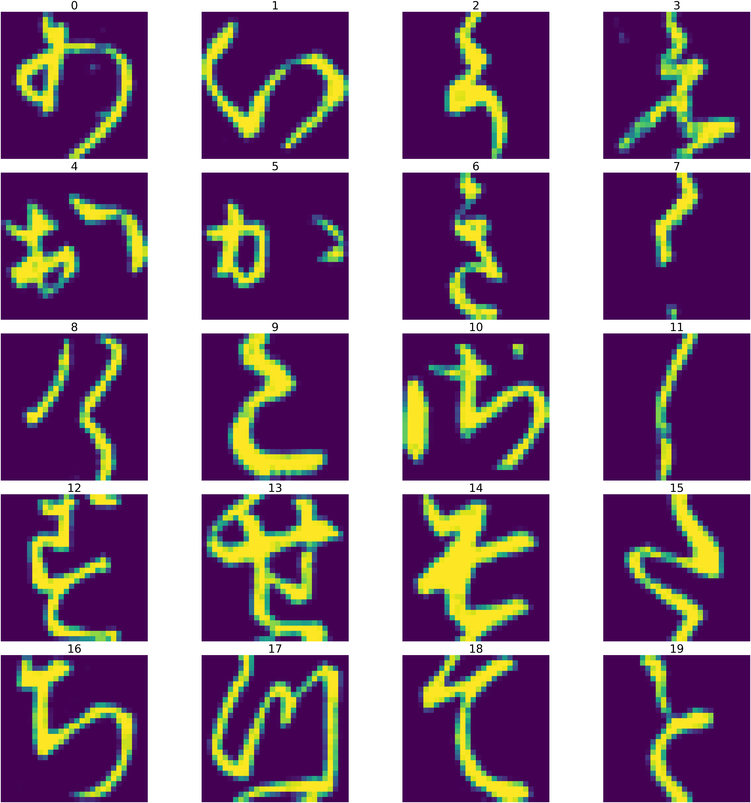
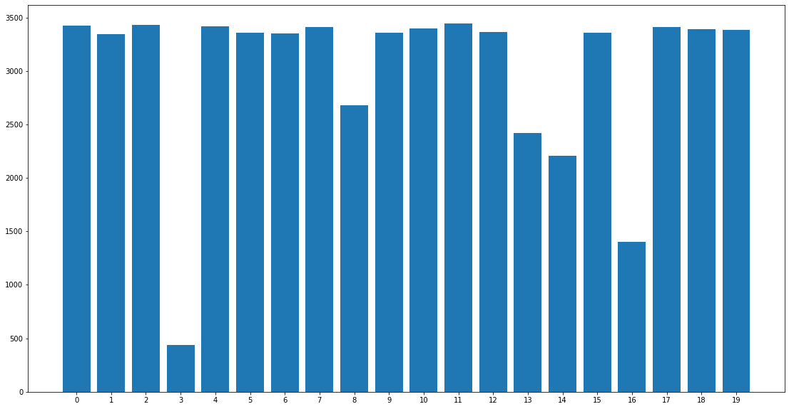
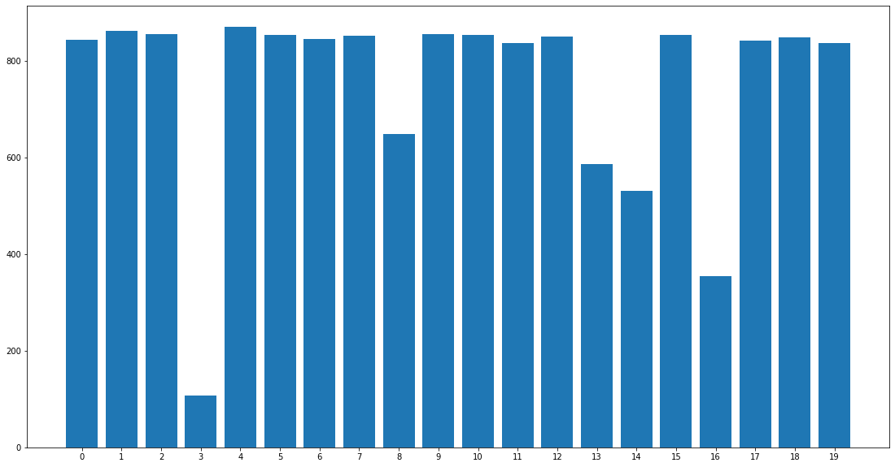

# Artificial Intelligence Computer Assignment 5
### Sepehr Ghobadi / Student No: 810098009

# Aim of Project

In this project we'll implement a feed-forward neural network from scratch to classify images and study effects of different hyperparameters on networks performance.


```python
import numpy as np
import matplotlib.pyplot as plt
import random, itertools, time
```

# 1. Dataset

Dataset containts 75000 pictures of "Kuzushiji" characters. Kuzushiji, a cursive writing style, was used in Japan for over a thousand years, beginning in the 8th century. <a href="https://github.com/rois-codh/kmnist">Kuzushiji-MNIST</a> is a drop-in replacement for the MNIST dataset (28x28 grayscale, 70,000 images), provided in the original MNIST format as well as a NumPy format.

Dataset is splited in a 80%/20% proportion for train and test and each picture is represented as a vector with size of 728 and train datas have a label between zero and 20.

## 1.1. Dataloader


```python
class Dataloader:

    def __init__(self, data, labels, n_classes, batch_size=None, shuffle=False):

        assert len(data)==len(labels)
        self.__n_classes = n_classes
        self.__batch_size = batch_size
        self.__shuffle = shuffle
        self.__data = data
        self.__labels = labels
        self.__onehot_labels = self.__onehot(labels, self.__n_classes)

    def __onehot(self, labels, n_classes):
        return [[0 if i!=label else 1 for i in range(n_classes)] for label in labels]

    def __shuffle_dataset(self):
        concat = np.hstack((self.__data, self.__onehot_labels))
        np.random.shuffle(concat)
        self.__data, self.__onehot_labels = concat[:,0:self.__data.shape[1]], concat[:,self.__data.shape[1]:]

    def get_class_info(self, class_):
        concat = np.hstack((self.__data, self.__labels[:,None]))
        class_images = concat[np.where(concat[:,-1]==class_)]
        np.random.shuffle(class_images)
        img = class_images[0]
        return {"sample":img[:img.shape[0]-1], "size":class_images.shape[0]}

    def normalize(self):
        self.__data = self.__data/255
        return self

    def __iter__(self):

        if self.__shuffle:
            self.__shuffle_dataset()

        if self.__batch_size==None:
            yield (np.matrix(self.__data), np.matrix(self.__onehot_labels))
            return

        for idx in range(0, len(self.__data), self.__batch_size):
            yield (np.matrix(self.__data[idx:idx+self.__batch_size]),
                   np.matrix(self.__onehot_labels[idx:idx+self.__batch_size]))
```


```python
load_images = lambda path,dtype : np.array(np.loadtxt(path, delimiter=',')[:,1:], dtype=dtype)
load_labels = lambda path,dtype : np.array(np.loadtxt(path, delimiter=',')[:,1], dtype=dtype)

train_data = load_images('./dataset/train_images.csv', dtype=float)
train_labels = load_labels('./dataset/train_labels.csv', dtype=int)
test_data = load_images('./dataset/test_images.csv', dtype=float)
test_labels = load_labels('./dataset/test_labels.csv', dtype=int)

trainloader = Dataloader(train_data, train_labels, n_classes=20, batch_size=64, shuffle=True)
testloader = Dataloader(test_data, test_labels, n_classes=20)
```

now we check a sample from each class of images:


```python
image_sample = {class_:trainloader.get_class_info(class_)["sample"].reshape((28, 28)) for class_ in np.unique(train_labels)}
fig, ax = plt.subplots(5, 4, figsize=(100,100))
fig.tight_layout(pad=10)

for class_ in np.unique(train_labels):
    ax[class_//4, class_%4].imshow(image_sample[class_])
    ax[class_//4, class_%4].set_title(class_, fontsize=100)
    ax[class_//4, class_%4].axis('off')
```





### 1.1. Frequency of each class in train and test datas


```python
values = np.unique(train_labels)
freqs = [trainloader.get_class_info(class_)["size"] for class_ in values]
fig, ax = plt.subplots(figsize=(max(values),10))
ax.bar(values, freqs, tick_label=values)
```


    <BarContainer object of 20 artists>





```python
values = np.unique(train_labels)
freqs = [testloader.get_class_info(class_)["size"] for class_ in values]
fig, ax = plt.subplots(figsize=(max(values),10))
ax.bar(values, freqs, tick_label=values)
```


    <BarContainer object of 20 artists>





each image is a 28*28 vector. for non-CNN networks we convert images to plane vector of size 748. each pixel values is in range (0,255) :


```python
trainloader.get_class_info(random.choice(values))["sample"].reshape((28, 28))
```


    array([[  0.,   0.,   0.,   0.,   0.,   0.,   0.,   0.,   0.,   0.,   0.,
              0.,  87.,  26.,   0.,  17.,   0.,   0.,   0.,   0.,   0.,   0.,
              0.,   0.,   0.,   0.,   0.,   0.],
           [  0.,   0.,   0.,   0.,   0.,   0.,   0.,   0.,   0.,   0.,   0.,
              0., 131., 128.,  73., 191.,   0.,   0.,   0.,   0.,   0.,   0.,
              0.,   0.,   0.,   0.,   0.,   0.],
           [  0.,   0.,   0.,   0.,   0.,   0.,   0.,   0.,   0.,   0.,   0.,
              0.,  47., 232., 197.,   1.,   0.,   0.,   0.,   0.,   0.,   0.,
              0.,   0.,   0.,   0.,   0.,   0.],
           [  0.,   0.,   0.,   0.,   0.,   0.,   0.,   0.,   0.,   0.,   0.,
              0.,   0.,  86., 203.,  18.,   0.,   0.,   0.,   0.,   0.,   0.,
              0.,   0.,   0.,   0.,   0.,   0.],
           [  0.,   0.,   0.,   0.,   0.,   0.,   0.,   0.,   0.,   0.,   0.,
              0.,   0.,  24., 244.,  68.,   0.,   0.,   0.,   0.,   0.,   0.,
              0.,   0.,   0.,   0.,   0.,   0.],
           [  0.,   0.,   0.,   0.,   0.,   0.,   0.,   0.,   0.,   0.,   0.,
              0.,   0.,   1., 204., 101.,   0.,   0.,   0.,   0.,   0.,   0.,
              0.,   0.,   0.,   0.,   0.,   0.],
           [  0.,   0.,   0.,   0.,   0.,   0.,   0.,   0.,   0.,   0.,   0.,
              0.,   0.,   0., 215., 203.,   0.,   0.,   0.,   0.,   0.,   0.,
              0.,   0.,   0.,   0.,   0.,   0.],
           [  0.,   0.,   0.,   0.,   0.,   0.,   0.,   0.,   0.,   0.,   0.,
              0.,   0.,   2., 221., 209.,   0.,   0.,   0.,   0.,   0.,   0.,
              0.,   0.,   0.,   0.,   0.,   0.],
           [  0.,   0.,   0.,   0.,   0.,   0.,   0.,   0.,   0.,   0.,   0.,
              0.,   0.,   6., 232., 145.,   0.,   0.,   0.,   0.,   0.,   0.,
              0.,   0.,   0.,   0.,   0.,   0.],
           [  0.,   0.,   0.,   0.,   0.,   0.,   0.,   0.,   0.,   0.,   0.,
              0.,   0.,   6., 234., 100.,   0.,   0.,   0.,   0.,   0.,   0.,
              0.,   0.,   0.,   0.,   0.,   0.],
           [  0.,   0.,   0.,   0.,   0.,   0.,   0.,   0.,   0.,   0.,   0.,
              0.,   0.,  19., 242.,  51.,   0.,   0.,   0.,   0.,   0.,   0.,
              0.,   0.,   0.,   0.,   0.,   0.],
           [  0.,   0.,   0.,   0.,   0.,   0.,   0.,   0.,   0.,   0.,   0.,
              0.,   0.,  79., 239.,  10.,   0.,   0.,   0.,   0.,   0.,   0.,
              0.,   0.,   0.,   0.,   0.,   0.],
           [  0.,   0.,   0.,   0.,   0.,   0.,   0.,   0.,   0.,   0.,   0.,
              0.,   0., 130., 198.,   1.,   0.,   0.,   0.,   0.,   0.,   0.,
              0.,   0.,   0.,   0.,   0.,   0.],
           [  0.,   0.,   0.,   0.,   0.,   0.,   0.,   0.,   0.,   0.,   0.,
              0.,   0., 147., 114.,   0.,   0.,   0.,   0.,   0.,   0.,   0.,
              0.,   0.,   0.,   0.,   0.,   0.],
           [  0.,   0.,   0.,   0.,   0.,   0.,   0.,   0.,   0.,   0.,   0.,
              0.,   0., 181.,  92.,   0.,   0.,   0.,   0.,   0.,   0.,   0.,
              0.,   0.,   0.,   0.,   0.,   0.],
           [  0.,   0.,   0.,   0.,   0.,   0.,   0.,   0.,   0.,   0.,   0.,
              0.,   0., 181.,  86.,   0.,   0.,   0.,   0.,   0.,   0.,   0.,
              0.,   0.,   0.,   0.,   0.,   0.],
           [  0.,   0.,   0.,   0.,   0.,   0.,   0.,   0.,   0.,   0.,   0.,
              0.,   0., 201.,  85.,   0.,   0.,   0.,   0.,   0.,   0.,   0.,
              0.,   0.,   0.,   0.,   0.,   0.],
           [  0.,   0.,   0.,   0.,   0.,   0.,   0.,   0.,   0.,   0.,   0.,
              0.,   0., 207., 115.,   0.,   0.,   0.,   0.,   0.,   0.,   0.,
              0.,   0.,   0.,   0.,   0.,   0.],
           [  0.,   0.,   0.,   0.,   0.,   0.,   0.,   0.,   0.,   0.,   0.,
              0.,   0., 206., 159.,   0.,   0.,   0.,   0.,   0.,   0.,   0.,
              0.,   0.,   0.,   0.,   0.,   0.],
           [  0.,   0.,   0.,   0.,   0.,   0.,   0.,   0.,   0.,   0.,   0.,
              0.,   0., 214., 161.,   0.,   0.,   0.,   0.,   0.,   0.,   0.,
              0.,   0.,   0.,   0.,   0.,   0.],
           [  0.,   0.,   0.,   0.,   0.,   0.,   0.,   0.,   0.,   0.,   0.,
              0.,   0., 184., 140.,   0.,   0.,   0.,   0.,   0.,   0.,   0.,
              0.,   0.,   0.,   0.,   0.,   0.],
           [  0.,   0.,   0.,   0.,   0.,   0.,   0.,   0.,   0.,   0.,   0.,
              0.,   0., 214., 120.,   0.,   0.,   0.,   0.,   0.,   0.,   0.,
              0.,   0.,   0.,   0.,   0.,   0.],
           [  0.,   0.,   0.,   0.,   0.,   0.,   0.,   0.,   0.,   0.,   0.,
              0.,   1., 210.,  96.,   0.,   0.,   0.,   0.,   0.,   0.,   0.,
              0.,   0.,   0.,   0.,   0.,   0.],
           [  0.,   0.,   0.,   0.,   0.,   0.,   0.,   0.,   0.,   0.,   0.,
              0.,   7., 227.,  58.,   0.,   0.,   0.,   0.,   0.,   0.,   0.,
              0.,   0.,   0.,   0.,   0.,   0.],
           [  0.,   0.,   0.,   0.,   0.,   0.,   0.,   0.,   0.,   0.,   0.,
              5.,   7., 216.,  23.,   0.,   0.,   0.,   0.,   0.,   0.,   0.,
              0.,   0.,   0.,   0.,   0.,   0.],
           [  0.,   0.,   0.,   0.,   0.,   0.,   0.,   0.,   0.,   0.,   0.,
             43., 110., 156.,   0.,   0.,   0.,   0.,   0.,   0.,   0.,   0.,
              0.,   0.,   0.,   0.,   0.,   0.],
           [  0.,   0.,   0.,   0.,   0.,   0.,   0.,   0.,   0.,   0.,   0.,
             49., 248., 110.,   0.,   0.,   0.,   0.,   0.,   0.,   0.,   0.,
              0.,   0.,   0.,   0.,   0.,   0.],
           [  0.,   0.,   0.,   0.,   0.,   0.,   0.,   0.,   0.,   0.,   0.,
             11., 120.,  76.,   0.,   0.,   0.,   0.,   0.,   0.,   0.,   0.,
              0.,   0.,   0.,   0.,   0.,   0.]])


Feeding non-normalized inputs to the network with values between 0 and 255. This faces the model to the explosion of gradient as the large inputs can result in large output values and large updating gradients. with non-normalized inputs, After each training batch, the error gradient of the network is computed and the model parameters will be updated. Error gradients can accumulate during an update and result in very large gradient and large updates to the network weights, and in turn, an unstable network. At an extreme, the values of weights can become so large as to overflow and result in NaN values. The whole issue is called the **explosion of the gradient**.

The simplest remedy for the explosion of the gradient in the previous section would be to scale down the input to values between 0 and 1.


```python
trainloader.normalize()
testloader.normalize()
trainloader.get_class_info(random.choice(values))["sample"].reshape((28, 28))
```


    array([[0.        , 0.        , 0.        , 0.        , 0.        ,
            0.        , 0.        , 0.        , 0.        , 0.        ,
            0.        , 0.        , 0.        , 0.        , 0.        ,
            0.        , 0.        , 0.        , 0.        , 0.        ,
            0.        , 0.        , 0.        , 0.        , 0.        ,
            0.        , 0.        , 0.        ],
           [0.        , 0.        , 0.        , 0.        , 0.        ,
            0.        , 0.        , 0.        , 0.        , 0.        ,
            0.        , 0.        , 0.        , 0.        , 0.        ,
            0.        , 0.        , 0.        , 0.        , 0.        ,
            0.        , 0.        , 0.        , 0.        , 0.        ,
            0.        , 0.        , 0.        ],
           [0.        , 0.        , 0.        , 0.        , 0.        ,
            0.        , 0.        , 0.        , 0.        , 0.        ,
            0.        , 0.        , 0.        , 0.        , 0.        ,
            0.        , 0.        , 0.        , 0.        , 0.        ,
            0.        , 0.        , 0.        , 0.        , 0.        ,
            0.        , 0.        , 0.        ],
           [0.        , 0.        , 0.        , 0.        , 0.        ,
            0.        , 0.        , 0.        , 0.00784314, 0.05882353,
            0.        , 0.        , 0.        , 0.        , 0.        ,
            0.        , 0.        , 0.        , 0.        , 0.        ,
            0.        , 0.        , 0.        , 0.        , 0.        ,
            0.        , 0.        , 0.        ],
           [0.        , 0.        , 0.        , 0.        , 0.        ,
            0.        , 0.        , 0.02352941, 0.63137255, 0.75686275,
            0.00392157, 0.        , 0.        , 0.        , 0.        ,
            0.        , 0.        , 0.        , 0.        , 0.        ,
            0.        , 0.        , 0.        , 0.        , 0.        ,
            0.        , 0.        , 0.        ],
           [0.        , 0.        , 0.        , 0.        , 0.        ,
            0.        , 0.        , 0.06666667, 0.94117647, 0.83529412,
            0.12156863, 0.        , 0.        , 0.        , 0.        ,
            0.        , 0.        , 0.        , 0.        , 0.        ,
            0.        , 0.        , 0.        , 0.        , 0.        ,
            0.        , 0.        , 0.        ],
           [0.        , 0.        , 0.        , 0.        , 0.        ,
            0.        , 0.        , 0.17647059, 0.99607843, 0.90196078,
            0.20784314, 0.        , 0.00392157, 0.        , 0.        ,
            0.        , 0.        , 0.        , 0.        , 0.        ,
            0.        , 0.        , 0.        , 0.        , 0.        ,
            0.        , 0.        , 0.        ],
           [0.        , 0.        , 0.        , 0.        , 0.        ,
            0.        , 0.        , 0.10588235, 0.90196078, 0.82352941,
            0.62352941, 0.42745098, 0.69019608, 0.29803922, 0.00392157,
            0.        , 0.        , 0.        , 0.        , 0.        ,
            0.        , 0.        , 0.        , 0.        , 0.        ,
            0.        , 0.        , 0.        ],
           [0.        , 0.        , 0.        , 0.        , 0.        ,
            0.        , 0.        , 0.10196078, 0.94509804, 0.91764706,
            0.91372549, 0.65882353, 0.79215686, 0.97254902, 0.16470588,
            0.        , 0.        , 0.        , 0.        , 0.        ,
            0.07058824, 0.35294118, 0.01176471, 0.        , 0.        ,
            0.        , 0.        , 0.        ],
           [0.        , 0.        , 0.        , 0.        , 0.        ,
            0.        , 0.        , 0.02745098, 0.8627451 , 0.85882353,
            0.85882353, 0.87058824, 0.8627451 , 0.99607843, 0.2745098 ,
            0.        , 0.        , 0.        , 0.        , 0.        ,
            0.03137255, 0.83137255, 0.49411765, 0.        , 0.        ,
            0.        , 0.        , 0.        ],
           [0.        , 0.        , 0.        , 0.        , 0.        ,
            0.        , 0.        , 0.        , 0.77647059, 0.99215686,
            0.89411765, 0.89803922, 0.36862745, 0.18823529, 0.01568627,
            0.        , 0.        , 0.        , 0.        , 0.        ,
            0.        , 0.19215686, 0.94117647, 0.44705882, 0.        ,
            0.        , 0.        , 0.        ],
           [0.        , 0.09803922, 0.68627451, 0.70196078, 0.66666667,
            0.7372549 , 0.59607843, 0.60784314, 0.85098039, 1.        ,
            0.89019608, 0.14901961, 0.        , 0.        , 0.        ,
            0.        , 0.        , 0.        , 0.        , 0.        ,
            0.        , 0.        , 0.35294118, 0.99215686, 0.52156863,
            0.        , 0.        , 0.        ],
           [0.        , 0.        , 0.18823529, 0.39607843, 0.79215686,
            0.92941176, 0.98431373, 1.        , 1.        , 0.83137255,
            0.08235294, 0.        , 0.        , 0.        , 0.        ,
            0.        , 0.        , 0.        , 0.        , 0.        ,
            0.        , 0.        , 0.00392157, 0.68627451, 0.96862745,
            0.69019608, 0.09019608, 0.        ],
           [0.        , 0.        , 0.        , 0.        , 0.        ,
            0.04313725, 0.13333333, 0.28627451, 0.79215686, 0.77647059,
            0.00392157, 0.        , 0.        , 0.        , 0.        ,
            0.        , 0.        , 0.        , 0.        , 0.        ,
            0.        , 0.        , 0.        , 0.1372549 , 0.87058824,
            1.        , 0.69411765, 0.2       ],
           [0.        , 0.        , 0.        , 0.        , 0.        ,
            0.        , 0.        , 0.00392157, 0.55686275, 0.80784314,
            0.04313725, 0.        , 0.        , 0.        , 0.        ,
            0.        , 0.        , 0.        , 0.        , 0.        ,
            0.        , 0.        , 0.        , 0.        , 0.3372549 ,
            0.99607843, 1.        , 0.54117647],
           [0.        , 0.        , 0.        , 0.        , 0.        ,
            0.        , 0.        , 0.09803922, 0.94509804, 1.        ,
            0.87843137, 0.59215686, 0.38431373, 0.24313725, 0.05882353,
            0.        , 0.        , 0.        , 0.        , 0.        ,
            0.        , 0.        , 0.        , 0.        , 0.01568627,
            0.71372549, 1.        , 0.75294118],
           [0.        , 0.        , 0.        , 0.        , 0.        ,
            0.        , 0.        , 0.52941176, 1.        , 1.        ,
            0.99607843, 0.85490196, 0.99215686, 0.99215686, 0.88627451,
            0.2745098 , 0.        , 0.        , 0.        , 0.        ,
            0.        , 0.        , 0.        , 0.        , 0.        ,
            0.50196078, 1.        , 0.98039216],
           [0.        , 0.        , 0.        , 0.        , 0.        ,
            0.        , 0.16470588, 0.95294118, 0.85490196, 0.42745098,
            0.30588235, 0.11372549, 0.0745098 , 0.85098039, 1.        ,
            0.55686275, 0.        , 0.        , 0.        , 0.        ,
            0.        , 0.        , 0.        , 0.        , 0.        ,
            0.02745098, 0.7254902 , 0.79607843],
           [0.        , 0.        , 0.        , 0.        , 0.        ,
            0.32156863, 0.90196078, 0.51764706, 0.02745098, 0.        ,
            0.        , 0.        , 0.04705882, 0.9372549 , 1.        ,
            0.65098039, 0.        , 0.        , 0.        , 0.        ,
            0.        , 0.        , 0.        , 0.        , 0.        ,
            0.        , 0.02352941, 0.02352941],
           [0.        , 0.        , 0.        , 0.        , 0.23137255,
            0.9372549 , 0.60784314, 0.00784314, 0.        , 0.        ,
            0.        , 0.        , 0.06666667, 0.88235294, 0.99215686,
            0.75294118, 0.00392157, 0.        , 0.        , 0.        ,
            0.        , 0.        , 0.        , 0.        , 0.        ,
            0.        , 0.        , 0.        ],
           [0.        , 0.        , 0.10588235, 0.59607843, 0.97647059,
            0.57647059, 0.04313725, 0.        , 0.        , 0.        ,
            0.        , 0.02352941, 0.66666667, 1.        , 1.        ,
            0.70196078, 0.00392157, 0.        , 0.        , 0.        ,
            0.        , 0.        , 0.        , 0.        , 0.        ,
            0.        , 0.        , 0.        ],
           [0.05490196, 0.02745098, 0.8       , 1.        , 0.81176471,
            0.11764706, 0.        , 0.        , 0.        , 0.        ,
            0.        , 0.52941176, 0.99607843, 1.        , 0.96078431,
            0.26666667, 0.        , 0.        , 0.        , 0.        ,
            0.        , 0.        , 0.        , 0.        , 0.        ,
            0.        , 0.        , 0.        ],
           [0.77254902, 0.8627451 , 0.96078431, 0.88235294, 0.0745098 ,
            0.36470588, 0.6745098 , 0.7254902 , 0.63529412, 0.32156863,
            0.3372549 , 0.85882353, 0.99215686, 0.98039216, 0.76078431,
            0.0745098 , 0.        , 0.        , 0.        , 0.        ,
            0.        , 0.        , 0.        , 0.        , 0.        ,
            0.        , 0.        , 0.        ],
           [0.70196078, 0.99607843, 0.97647059, 0.29019608, 0.        ,
            0.        , 0.05098039, 0.22352941, 0.42745098, 0.57647059,
            0.64705882, 0.68627451, 0.30588235, 0.27058824, 0.05098039,
            0.        , 0.        , 0.        , 0.        , 0.        ,
            0.        , 0.        , 0.        , 0.        , 0.        ,
            0.        , 0.        , 0.00392157],
           [0.04705882, 0.16470588, 0.15294118, 0.00392157, 0.        ,
            0.        , 0.        , 0.        , 0.        , 0.        ,
            0.        , 0.        , 0.        , 0.        , 0.        ,
            0.        , 0.        , 0.        , 0.        , 0.        ,
            0.        , 0.        , 0.        , 0.        , 0.        ,
            0.        , 0.        , 0.02745098],
           [0.        , 0.        , 0.        , 0.        , 0.        ,
            0.        , 0.        , 0.        , 0.        , 0.        ,
            0.        , 0.        , 0.        , 0.        , 0.        ,
            0.        , 0.        , 0.        , 0.        , 0.        ,
            0.        , 0.        , 0.        , 0.        , 0.        ,
            0.        , 0.        , 0.        ],
           [0.        , 0.        , 0.        , 0.        , 0.        ,
            0.        , 0.        , 0.        , 0.        , 0.        ,
            0.        , 0.        , 0.        , 0.        , 0.        ,
            0.        , 0.        , 0.        , 0.        , 0.        ,
            0.        , 0.        , 0.        , 0.        , 0.        ,
            0.        , 0.        , 0.        ],
           [0.        , 0.        , 0.        , 0.        , 0.        ,
            0.        , 0.        , 0.        , 0.        , 0.        ,
            0.        , 0.        , 0.        , 0.        , 0.        ,
            0.        , 0.        , 0.        , 0.        , 0.        ,
            0.        , 0.        , 0.        , 0.        , 0.        ,
            0.        , 0.        , 0.        ]])


# 2. Implementing Network

## 2.1 Activation Functions


```python
class Identical:

    def __init__(self): pass

    def __val(self, matrix):
        identical_value = np.matrix(matrix, dtype=float)
        return identical_value

    def derivative(self, matrix):
        temp = np.matrix(matrix, dtype=float)
        identical_derivative = np.matrix(np.full(np.shape(temp), 1.))
        return identical_derivative

    def __call__(self, matrix):
        return self.__val(matrix)


class Relu:

    def __init__(self): pass

    def __val(self, matrix):
        matrix = matrix.copy()
        matrix[matrix<0] = 0
        return np.matrix(matrix)

    def derivative(self, matrix):
        matrix = matrix.copy()
        matrix[matrix<0] = 0
        matrix[matrix>0] = 1
        return np.matrix(matrix)

    def __call__(self, matrix):
        return self.__val(matrix)

    def __repr__(self):
        return 'ReLu'


class LeakyRelu:

    def __init__(self, negative_slope=0.01):
        self.negative_slope = negative_slope

    def __val(self, matrix):
        matrix = matrix.copy()
        return np.matrix( np.maximum(matrix, matrix*self.negative_slope) )

    def derivative(self, matrix):
        matrix = matrix.copy()
        matrix[matrix > 0] = 1
        matrix[matrix < 0] = self.negative_slope
        return np.matrix(matrix)

    def __call__(self, matrix):
        return self.__val(matrix)

    def __repr__(self):
        return 'LeakyReLu'


class Sigmoid:

    def __init__(self): pass

    def __val(self, matrix):
        return np.matrix(1/(1+np.exp(-1*matrix)))

    def derivative(self, matrix):
        sigmoid = self.__val(matrix)
        return np.multiply(sigmoid, (1- sigmoid))

    def __call__(self, matrix):
        return self.__val(matrix)

    def __repr__(self):
        return 'Sigmoid'


class Softmax:

    def __init__(self): pass

    def __val(self, matrix):
        matrix=matrix.copy()
        matrix = np.exp(matrix-np.max(matrix,-1))
        return np.divide(matrix, np.matrix(np.sum(matrix, axis=1)))

    def derivative(self, matrix):
        matrix = matrix.copy()
        matrix = self(matrix)
        return np.multiply(matrix, 1.0-matrix)

    def __call__(self, matrix):
        return self.__val(matrix)

    def __repr__(self):
        return 'Softmax'

class Tanh:

    def __init__(self): pass

    def __val(self, matrix):
        return np.matrix((np.exp(matrix)-np.exp(-1*matrix))/((np.exp(matrix)+np.exp(-1*matrix))))

    def derivative(self, matrix):
        tanh = self.__val(matrix)
        return np.matrix(1-np.multiply(tanh, tanh))

    def __call__(self, matrix):
        return self.__val(matrix)

    def __repr__(self):
        return 'TanH'
```

## 2.2 Loss Function


```python
class CrossEntropy: #(with softmax)

    def __init__(self): pass

    def __val(self, true_val, expected_val):
        assert np.shape(true_val)==np.shape(expected_val)
        true_val = np.matrix(true_val.copy())
        expected_val = np.matrix(expected_val.copy())
        softmax = Softmax()
        return np.mean(-np.multiply(np.matrix(np.log((softmax(true_val)+1e-3))), expected_val), -1)
    def derivative(self, true_val, expected_val):
        assert np.shape(true_val)==np.shape(expected_val)
        true_val = np.matrix(true_val.copy())
        expected_val = np.matrix(expected_val.copy())
        softmax = Softmax()
        return np.matrix(softmax(true_val)-expected_val)

    def __call__(self, true_val, expected_val):
        return self.__val(true_val, expected_val)
```

## 2.3 Layer


```python
class Layer:

    DEFAULT_LOW, DEFAULT_HIGH, DEFAULT_MEAN, DEFAULT_VAR = 0, 0.05, 0., 1.

    def __init__(self, input_size, output_size,
                 activation=Identical(), initial_weight='uniform', **initializing_parameters):

        assert type(initial_weight)==str, 'Undefined activation function!'

        self.__weight_initializer_dict = {'uniform':self.__uniform_weight, 'normal':self.__normal_weight, 'same':self.__same_weight}

        assert initial_weight in self.__weight_initializer_dict, 'Undefined weight initialization function!'


        self.__n_neurons = output_size
        weight_initializer = self.__weight_initializer_dict[initial_weight]
        self.__weight = weight_initializer(input_size, self.__n_neurons, **initializing_parameters)
        self.__bias = weight_initializer(1, self.__n_neurons, **initializing_parameters)
        self.__activation = activation

        self.__last_input = 0
        self.__last_activation_input = 0
        self.__last_activation_output = 0
        self.__last_activation_derivative = 0
        self.__last_weights_update = 0
        self.__last_bias_update = 0

    def forward(self, layer_input):
        assert np.ndim(layer_input)==2
        assert np.size(self.__weight,0) == np.size(layer_input,1)
        self.__last_input = np.matrix(layer_input)
        self.__last_activation_input = np.matmul(self.__last_input, self.__weight) + self.__bias
        self.__last_activation_output = self.__activation(self.__last_activation_input)
        self.__last_activation_derivative = self.__activation.derivative(self.__last_activation_input)
        return self.__last_activation_output

    def update_weights(self, backprop_tensor, lr)
        assert np.ndim(backprop_tensor)==2
        assert np.size(backprop_tensor,0) == np.size(self.__last_activation_derivative,0)
        assert np.size(backprop_tensor,1) == self.__n_neurons

        backprop_tensor = np.multiply(np.matrix(backprop_tensor), self.__last_activation_derivative)
        bias_update = lr * np.sum(backprop_tensor, 0)
        weights_update = lr * np.matmul(self.__last_input.transpose(), backprop_tensor)
        backprop_tensor = np.matmul(backprop_tensor, self.__weight.transpose())

        self.__weight -= weights_update
        self.__last_weights_update = weights_update

        self.__bias -= bias_update
        self.__last_bias_update = bias_update

        return backprop_tensor

    def __uniform_weight(self, dim1, dim2, **initializing_parameters):
        low, high = self.DEFAULT_LOW, self.DEFAULT_HIGH
        if 'low' in initializing_parameters.keys(): low = initializing_parameters['low']
        if 'high' in initializing_parameters.keys(): high = initializing_parameters['high']
        weights = np.matrix(np.random.uniform(low=low, high=high, size=(dim1, dim2)))
        return weights

    def __normal_weight(self, dim1, dim2, **initializing_parameters):
        mean, var = self.DEFAULT_MEAN, self.DEFAULT_VAR
        if 'mean' in initializing_parameters.keys(): mean = initializing_parameters['mean']
        if 'var' in initializing_parameters.keys(): var = initializing_parameters['var']
        weights = var * np.matrix(np.random.randn(dim1, dim2)) + mean
        return weights

    def __same_weight(self, dim1, dim2, **initializing_parameters):
        value = 0
        if 'value' in initializing_parameters.keys(): value = initializing_parameters['value']
        weights = np.matrix(np.zeros([dim1, dim2])) + value
        return weights

    @property
    def n_neurons(self): return self.__n_neurons

    @property
    def weight(self): return self.__weight

    @property
    def bias(self): return self.__bias

    @property
    def activation(self): return self.__activation
```

## 2.4. Feed Forward Neural Network


```python
class FeedForwardNN:

    def __init__(self, input_shape):

        self.__input_shape = input_shape
        self.__output_shape = None

        self.__layers_list = []

        self.__lr = None
        self.__loss = None


    def add_layer(self, n_neurons, activation=Relu(), initial_weight='uniform', **initializing_parameters):

        assert type(n_neurons)==int, "Invalid number of neurons for the layer!"
        assert n_neurons>0, "Invalid number of neurons for the layer!"

        n_prev_neurons = self.__input_shape if len(self.__layers_list)==0 else self.__layers_list[-1].n_neurons
        new_layer = Layer(n_prev_neurons, n_neurons, activation, initial_weight, **initializing_parameters)
        self.__layers_list.append(new_layer)
        self.__output_shape = self.__layers_list[-1].n_neurons


    def set_training_param(self, loss=CrossEntropy(), lr=1e-3):
        assert self.__layers_list, "Uncomplete model!"
        self.__loss = loss
        self.__lr = lr


    def forward(self, network_input):
        assert type(self.__output_shape) != None, "Model is not compiled!"
        network_output = network_input
        for network_layer in self.__layers_list:
            network_output = network_layer.forward(network_output)
        return network_output


    def fit(self, epochs, trainloader, testloader=None, print_epochs_results=True, print_last_epoch_result=True):

        assert type(self.__output_shape) != None, "Model is not compiled!"
        assert type(self.__lr) != None and type(self.__loss) != None, "Training paramenters are not set!"

        log = {"train_accuracy":[], "train_loss":[], "test_accuracy":[], "test_loss":[]}

        for epoch in range(1, epochs+1):

            if print_epochs_results or (print_last_epoch_result and epoch == epochs):
                print('Epoch {}:'.format(epoch))

            average_accuracy, average_loss = self.__train(trainloader)
            log['train_accuracy'].append(average_accuracy*100)
            log['train_loss'].append(average_loss)
            if print_epochs_results or (print_last_epoch_result and epoch == epochs):
                print('\tTrain: Average Accuracy: {}\tAverage Loss: {}'.format(average_accuracy, average_loss))

            if type(testloader) != type(None):
                average_accuracy, average_loss = self.__test(testloader)
                log['test_accuracy'].append(average_accuracy*100)
                log['test_loss'].append(average_loss)
                if print_epochs_results or (print_last_epoch_result and epoch == epochs):
                    print('\tTest: Average Accuracy: {}\tAverage Loss: {}'.format(average_accuracy, average_loss))

        return log


    def __train(self, trainloader):
        bach_accuracies, batch_losses = [], []
        for x_train, y_train in trainloader:
            batch_accuracy, batch_loss = self.__train_on_batch(x_train, y_train)
            bach_accuracies.append(batch_accuracy)
            batch_losses.append(batch_loss)
        return np.mean(bach_accuracies), np.mean(batch_losses)


    def __test(self, testloader):
        bach_accuracies, batch_losses = [], []
        for x_test, y_test in testloader:
            batch_accuracy, batch_loss = self.__test_on_batch(x_test, y_test)
            bach_accuracies.append(batch_accuracy)
            batch_losses.append(batch_loss)
        return np.mean(bach_accuracies), np.mean(batch_losses)


    def __batch_forward(self, x_batch, y_batch, update=True):
        output = self.forward(x_batch)
        if update:
            self.__update_weights(output, y_batch)
        batch_accuracy = self.__compute_accuracy(output, y_batch)
        batch_average_loss = np.mean(self.__loss(output, y_batch))
        return (batch_accuracy, batch_average_loss)

    def __train_on_batch(self, x_batch, y_batch):
        return self.__batch_forward(x_batch, y_batch, update=True)

    def __test_on_batch(self, x_batch, y_batch):
        return self.__batch_forward(x_batch, y_batch, update=False)


    def __get_labels(self, outputs):
        labels = np.argmax(np.array(outputs), axis=-1)
        return labels


    def __compute_accuracy(self, output, expected_output):
        corrects = np.sum(self.__get_labels(output)==self.__get_labels(expected_output))
        accuracy = corrects / len(expected_output)
        return accuracy


    def __update_weights(self, output, y_train):
        backprop_values = self.__loss.derivative(output, y_train)
        for layer in reversed(self.__layers_list):
            backprop_values = layer.update_weights(backprop_values, self.__lr)
```

# 3. Building And Training Model


```python
# helper function for plotting results
def plot_results(train_accuracy, test_accuracy, train_loss, test_loss, x_label, x_values):

    fig, (ax1, ax2) = plt.subplots(1, 2, figsize=(25,6))

    ax1.plot(x_values, train_loss, color='green', label='Loss on train data')
    ax1.plot(x_values, test_loss, color='blue', label='Loss on validation data')
    ax1.set_xlabel(x_label)
    ax1.set_ylabel('Loss')
    ax1.set_title('Loss Plot')
    ax1.legend()

    ax2.plot(x_values, train_accuracy, color='green', label='Accuracy on train data')
    ax2.plot(x_values, test_accuracy, color='blue', label='Accuracy on validation data')
    ax2.set_xlabel(x_label)
    ax2.set_ylabel('Accuracy Percentage')
    ax2.set_title('Accuracy Plot')
    ax2.legend()
```


```python
INPUT_SHAPE = 784
LEARNING_RATE = 0.001
EPOCHS = 100


network = FeedForwardNN(INPUT_SHAPE)
network.add_layer(100, activation=Relu(), initial_weight='uniform')
network.add_layer(20, activation=Relu(), initial_weight='uniform')
network.add_layer(64, activation=Relu(), initial_weight='uniform')
network.add_layer(20, activation=Identical(), initial_weight='uniform')
network.set_training_param(loss=CrossEntropy(), lr=LEARNING_RATE)

logs1 = network.fit(EPOCHS, trainloader, testloader, print_epochs_results=True)
```

    Epoch 1:
    	Train: Average Accuracy: 0.09810929120630614	Average Loss: 0.14213457423451492
    	Test: Average Accuracy: 0.14272381841210585	Average Loss: 0.13404139149265784
    Epoch 2:
    	Train: Average Accuracy: 0.21189860357304388	Average Loss: 0.11624104945386844
    	Test: Average Accuracy: 0.22578494767015533	Average Loss: 0.11510731240489126
    Epoch 3:
    	Train: Average Accuracy: 0.3732993918395038	Average Loss: 0.09468146761194958
    	Test: Average Accuracy: 0.4205719618692087	Average Loss: 0.09326069855283449
    Epoch 4:
    	Train: Average Accuracy: 0.5611098323318473	Average Loss: 0.06918923925342751
    	Test: Average Accuracy: 0.5300979934671022	Average Loss: 0.07600155775931611
    Epoch 5:
    	Train: Average Accuracy: 0.6813916416295148	Average Loss: 0.05181210594151789
    	Test: Average Accuracy: 0.6166255582961135	Average Loss: 0.06325251336718425
    Epoch 6:
    	Train: Average Accuracy: 0.7435781724494411	Average Loss: 0.04186641365043991
    	Test: Average Accuracy: 0.6661555896273582	Average Loss: 0.054445574896178656
    Epoch 7:
    	Train: Average Accuracy: 0.781411025230988	Average Loss: 0.03556141634417119
    	Test: Average Accuracy: 0.70115325644957	Average Loss: 0.04927775099746675
    Epoch 8:
    	Train: Average Accuracy: 0.8106267566388835	Average Loss: 0.030949479412019826
    	Test: Average Accuracy: 0.7255516298913406	Average Loss: 0.04595360399136587
    Epoch 9:
    	Train: Average Accuracy: 0.8368254102862313	Average Loss: 0.02714004334622358
    	Test: Average Accuracy: 0.7497500166655556	Average Loss: 0.041982141566241866
    Epoch 10:
    	Train: Average Accuracy: 0.8533686074497642	Average Loss: 0.024197333204167816
    	Test: Average Accuracy: 0.7552163189120725	Average Loss: 0.0410637352316994
    Epoch 11:
    	Train: Average Accuracy: 0.8684575297215222	Average Loss: 0.02187011034839075
    	Test: Average Accuracy: 0.7756816212252516	Average Loss: 0.03773410101460339
    Epoch 12:
    	Train: Average Accuracy: 0.8793683772694967	Average Loss: 0.019909009306448587
    	Test: Average Accuracy: 0.7764149056729551	Average Loss: 0.03746268318951053
    Epoch 13:
    	Train: Average Accuracy: 0.8883479316081928	Average Loss: 0.018390328499676527
    	Test: Average Accuracy: 0.7938804079728018	Average Loss: 0.034687598430456414
    Epoch 14:
    	Train: Average Accuracy: 0.8981260499450798	Average Loss: 0.016906270458767043
    	Test: Average Accuracy: 0.7986800879941337	Average Loss: 0.03364047138346969
    Epoch 15:
    	Train: Average Accuracy: 0.905901196129741	Average Loss: 0.01563570816910168
    	Test: Average Accuracy: 0.8094793680421305	Average Loss: 0.03253243186486381
    Epoch 16:
    	Train: Average Accuracy: 0.9118187471732249	Average Loss: 0.014621528623538752
    	Test: Average Accuracy: 0.8017465502299846	Average Loss: 0.033783322692482846
    Epoch 17:
    	Train: Average Accuracy: 0.9159978314595851	Average Loss: 0.013707966761688232
    	Test: Average Accuracy: 0.8204786347576828	Average Loss: 0.03113326164611607
    Epoch 18:
    	Train: Average Accuracy: 0.9220769125153454	Average Loss: 0.012789524478197825
    	Test: Average Accuracy: 0.8168788747416839	Average Loss: 0.031425391734156344
    Epoch 19:
    	Train: Average Accuracy: 0.9251252867157719	Average Loss: 0.012089523945201937
    	Test: Average Accuracy: 0.8266115592293847	Average Loss: 0.030553529952164593
    Epoch 20:
    	Train: Average Accuracy: 0.9301539179104478	Average Loss: 0.011437238690965065
    	Test: Average Accuracy: 0.8302113192453836	Average Loss: 0.02999902485293449
    Epoch 21:
    	Train: Average Accuracy: 0.9327045777605479	Average Loss: 0.010807251604996758
    	Test: Average Accuracy: 0.8234784347710152	Average Loss: 0.031103392671843304
    Epoch 22:
    	Train: Average Accuracy: 0.9381360244233379	Average Loss: 0.01010556177533023
    	Test: Average Accuracy: 0.8304779681354576	Average Loss: 0.029881773189800516
    Epoch 23:
    	Train: Average Accuracy: 0.940450446630484	Average Loss: 0.009671965296126014
    	Test: Average Accuracy: 0.8358109459369375	Average Loss: 0.029550161066579213
    Epoch 24:
    	Train: Average Accuracy: 0.943480143923241	Average Loss: 0.009046208159946141
    	Test: Average Accuracy: 0.834011065928938	Average Loss: 0.02983141475505655
    Epoch 25:
    	Train: Average Accuracy: 0.9476622568973315	Average Loss: 0.008600101632886329
    	Test: Average Accuracy: 0.8324778348110126	Average Loss: 0.03023766717429864
    Epoch 26:
    	Train: Average Accuracy: 0.948578434935711	Average Loss: 0.008167078413129513
    	Test: Average Accuracy: 0.8311445903606426	Average Loss: 0.03076351636143355
    Epoch 27:
    	Train: Average Accuracy: 0.9518923240938166	Average Loss: 0.007724864421661847
    	Test: Average Accuracy: 0.836944203719752	Average Loss: 0.030256413294796832
    Epoch 28:
    	Train: Average Accuracy: 0.9528938101699296	Average Loss: 0.007496084173414444
    	Test: Average Accuracy: 0.835877608159456	Average Loss: 0.030821548065426405
    Epoch 29:
    	Train: Average Accuracy: 0.9556256865025522	Average Loss: 0.007016529469405182
    	Test: Average Accuracy: 0.8280781281247916	Average Loss: 0.032922642417636934
    Epoch 30:
    	Train: Average Accuracy: 0.957941118272275	Average Loss: 0.006723134287133316
    	Test: Average Accuracy: 0.833744417038864	Average Loss: 0.03122016096704799
    Epoch 31:
    	Train: Average Accuracy: 0.9579900820572462	Average Loss: 0.00655940965171704
    	Test: Average Accuracy: 0.835877608159456	Average Loss: 0.031443617709328776
    Epoch 32:
    	Train: Average Accuracy: 0.9615381897331524	Average Loss: 0.0061207587053026796
    	Test: Average Accuracy: 0.8308779414705686	Average Loss: 0.03263767162509493
    Epoch 33:
    	Train: Average Accuracy: 0.9624543677715319	Average Loss: 0.005894118583201281
    	Test: Average Accuracy: 0.8306112925804946	Average Loss: 0.032678656993207184
    Epoch 34:
    	Train: Average Accuracy: 0.964419986108419	Average Loss: 0.005528431443742066
    	Test: Average Accuracy: 0.834277714819012	Average Loss: 0.032400600240722
    Epoch 35:
    	Train: Average Accuracy: 0.9672851247011695	Average Loss: 0.005217330187446758
    	Test: Average Accuracy: 0.8314779014732351	Average Loss: 0.03260996174479096
    Epoch 36:
    	Train: Average Accuracy: 0.9661347281449894	Average Loss: 0.005289657873367076
    	Test: Average Accuracy: 0.8296113592427171	Average Loss: 0.03386739786595043
    Epoch 37:
    	Train: Average Accuracy: 0.9691361576855979	Average Loss: 0.004812610982372237
    	Test: Average Accuracy: 0.8323445103659756	Average Loss: 0.033391560462187726
    Epoch 38:
    	Train: Average Accuracy: 0.9702678773341087	Average Loss: 0.004652839007433892
    	Test: Average Accuracy: 0.8372775148323445	Average Loss: 0.03273719323967853
    Epoch 39:
    	Train: Average Accuracy: 0.970682302771855	Average Loss: 0.0044806053279153385
    	Test: Average Accuracy: 0.8332777814812345	Average Loss: 0.03411433451542588
    Epoch 40:
    	Train: Average Accuracy: 0.9712330191574595	Average Loss: 0.0043864853749189135
    	Test: Average Accuracy: 0.8346110259316045	Average Loss: 0.03376620588832249
    Epoch 41:
    	Train: Average Accuracy: 0.9722981076759062	Average Loss: 0.004263992753985369
    	Test: Average Accuracy: 0.83347776814879	Average Loss: 0.034781298941600425
    Epoch 42:
    	Train: Average Accuracy: 0.9731809701492538	Average Loss: 0.00413917619279155
    	Test: Average Accuracy: 0.8319445370308646	Average Loss: 0.0344847025965775
    Epoch 43:
    	Train: Average Accuracy: 0.9746655319183305	Average Loss: 0.0037810000305254967
    	Test: Average Accuracy: 0.8354109726018265	Average Loss: 0.03510188091329635
    Epoch 44:
    	Train: Average Accuracy: 0.9754974114815533	Average Loss: 0.0036158639164948665
    	Test: Average Accuracy: 0.8366108926071595	Average Loss: 0.03396389849426895
    Epoch 45:
    	Train: Average Accuracy: 0.9775296609485042	Average Loss: 0.003430378318749874
    	Test: Average Accuracy: 0.8328778081461236	Average Loss: 0.03552028833195841
    Epoch 46:
    	Train: Average Accuracy: 0.9793463688053241	Average Loss: 0.003198332009969699
    	Test: Average Accuracy: 0.83481101259916	Average Loss: 0.03571397743225965
    Epoch 47:
    	Train: Average Accuracy: 0.9793610074626866	Average Loss: 0.0031858735035631717
    	Test: Average Accuracy: 0.8406106259582694	Average Loss: 0.03481501632613843
    Epoch 48:
    	Train: Average Accuracy: 0.9789612206823027	Average Loss: 0.0032008942003793907
    	Test: Average Accuracy: 0.8324778348110126	Average Loss: 0.036878217959397136
    Epoch 49:
    	Train: Average Accuracy: 0.9795775586353944	Average Loss: 0.0030672833745001714
    	Test: Average Accuracy: 0.834144390373975	Average Loss: 0.03679861084130546
    Epoch 50:
    	Train: Average Accuracy: 0.9794119903728113	Average Loss: 0.0030858709874744517
    	Test: Average Accuracy: 0.8326111592560496	Average Loss: 0.03686020711386799
    Epoch 51:
    	Train: Average Accuracy: 0.9795609008528785	Average Loss: 0.0030222864754216408
    	Test: Average Accuracy: 0.835744283714419	Average Loss: 0.03636315131012299
    Epoch 52:
    	Train: Average Accuracy: 0.9836753731343284	Average Loss: 0.0025553529557632033
    	Test: Average Accuracy: 0.8272115192320512	Average Loss: 0.03817475408442046
    Epoch 53:
    	Train: Average Accuracy: 0.9835441299993539	Average Loss: 0.0024268447790585035
    	Test: Average Accuracy: 0.833344443703753	Average Loss: 0.037503038432079625
    Epoch 54:
    	Train: Average Accuracy: 0.9826945830910384	Average Loss: 0.0026577347846621926
    	Test: Average Accuracy: 0.8363442437170855	Average Loss: 0.037414130551664315
    Epoch 55:
    	Train: Average Accuracy: 0.9824936801382698	Average Loss: 0.002611622175294277
    	Test: Average Accuracy: 0.8321445236984201	Average Loss: 0.038764535828159336
    Epoch 56:
    	Train: Average Accuracy: 0.9849923475156684	Average Loss: 0.0023023435567018566
    	Test: Average Accuracy: 0.8262115858942737	Average Loss: 0.039277424161325625
    Epoch 57:
    	Train: Average Accuracy: 0.9815608443173742	Average Loss: 0.0027842467560180275
    	Test: Average Accuracy: 0.8278114792347177	Average Loss: 0.03956923179846424
    Epoch 58:
    	Train: Average Accuracy: 0.9822271556180139	Average Loss: 0.0026423359501281532
    	Test: Average Accuracy: 0.8356776214919005	Average Loss: 0.037364956751426
    Epoch 59:
    	Train: Average Accuracy: 0.986323960554371	Average Loss: 0.002041072835637613
    	Test: Average Accuracy: 0.8351443237117525	Average Loss: 0.03799504402257811
    Epoch 60:
    	Train: Average Accuracy: 0.9864758997221684	Average Loss: 0.002087339888329967
    	Test: Average Accuracy: 0.834411039264049	Average Loss: 0.03851050065998301
    Epoch 61:
    	Train: Average Accuracy: 0.9869246502875234	Average Loss: 0.001982140455226215
    	Test: Average Accuracy: 0.8362109192720485	Average Loss: 0.03842079682694162
    Epoch 62:
    	Train: Average Accuracy: 0.9858918677715319	Average Loss: 0.0020653149785031777
    	Test: Average Accuracy: 0.8272115192320512	Average Loss: 0.041149400437964924
    Epoch 63:
    	Train: Average Accuracy: 0.9855420543386961	Average Loss: 0.002102612176996942
    	Test: Average Accuracy: 0.8338110792613825	Average Loss: 0.03967264603245822
    Epoch 64:
    	Train: Average Accuracy: 0.9816951161400789	Average Loss: 0.0027440046193760747
    	Test: Average Accuracy: 0.8137457502833144	Average Loss: 0.04316459212365257
    Epoch 65:
    	Train: Average Accuracy: 0.9809934701492538	Average Loss: 0.002785641981103781
    	Test: Average Accuracy: 0.8330111325911606	Average Loss: 0.0391307662342037
    Epoch 66:
    	Train: Average Accuracy: 0.9870735607675906	Average Loss: 0.0019595674256972667
    	Test: Average Accuracy: 0.8356776214919005	Average Loss: 0.03945361945526065
    Epoch 67:
    	Train: Average Accuracy: 0.9905550373134329	Average Loss: 0.001481987322610072
    	Test: Average Accuracy: 0.835877608159456	Average Loss: 0.039713592520333296
    Epoch 68:
    	Train: Average Accuracy: 0.9890735042320864	Average Loss: 0.001639814559484207
    	Test: Average Accuracy: 0.833744417038864	Average Loss: 0.039724642148619295
    Epoch 69:
    	Train: Average Accuracy: 0.9881739839762228	Average Loss: 0.0017260877045498732
    	Test: Average Accuracy: 0.8371441903873075	Average Loss: 0.040025217005061814
    Epoch 70:
    	Train: Average Accuracy: 0.9900053304904051	Average Loss: 0.0014888079832754803
    	Test: Average Accuracy: 0.8297446836877541	Average Loss: 0.04081047951787817
    Epoch 71:
    	Train: Average Accuracy: 0.987690908283259	Average Loss: 0.0017818596834607361
    	Test: Average Accuracy: 0.8321445236984201	Average Loss: 0.04077368501158764
    Epoch 72:
    	Train: Average Accuracy: 0.9848434370356013	Average Loss: 0.0021789589108522035
    	Test: Average Accuracy: 0.83614425704953	Average Loss: 0.040155427318804525
    Epoch 73:
    	Train: Average Accuracy: 0.9877065565031983	Average Loss: 0.0017925014918089423
    	Test: Average Accuracy: 0.8368775414972335	Average Loss: 0.03939725457486864
    Epoch 74:
    	Train: Average Accuracy: 0.992204157782516	Average Loss: 0.001181039782236123
    	Test: Average Accuracy: 0.8376774881674555	Average Loss: 0.03985013621129866
    Epoch 75:
    	Train: Average Accuracy: 0.9937200159914712	Average Loss: 0.0009559426196003203
    	Test: Average Accuracy: 0.836277581494567	Average Loss: 0.04037357816488365
    Epoch 76:
    	Train: Average Accuracy: 0.9963186300639659	Average Loss: 0.0006483965702575063
    	Test: Average Accuracy: 0.8356776214919005	Average Loss: 0.04090811957252212
    Epoch 77:
    	Train: Average Accuracy: 0.9977855244879499	Average Loss: 0.00043217929441773144
    	Test: Average Accuracy: 0.8379441370575295	Average Loss: 0.04043345978150553
    Epoch 78:
    	Train: Average Accuracy: 0.9987340085287847	Average Loss: 0.0002658559964598915
    	Test: Average Accuracy: 0.8408772748483434	Average Loss: 0.04012745972798781
    Epoch 79:
    	Train: Average Accuracy: 0.9992837153518124	Average Loss: 0.00016966515984591441
    	Test: Average Accuracy: 0.837877474835011	Average Loss: 0.04020057995385133
    Epoch 80:
    	Train: Average Accuracy: 0.9996335287846482	Average Loss: 0.00010214298446157733
    	Test: Average Accuracy: 0.8400773281781214	Average Loss: 0.04040481555219319
    Epoch 81:
    	Train: Average Accuracy: 0.9997501332622601	Average Loss: 7.009344070227626e-05
    	Test: Average Accuracy: 0.8416772215185654	Average Loss: 0.04035910316090054
    Epoch 82:
    	Train: Average Accuracy: 0.9997834488272921	Average Loss: 5.4497276237786785e-05
    	Test: Average Accuracy: 0.8418772081861209	Average Loss: 0.040298461017246164
    Epoch 83:
    	Train: Average Accuracy: 0.9997667910447762	Average Loss: 5.431375266288529e-05
    	Test: Average Accuracy: 0.8424771681887874	Average Loss: 0.04053159229499803
    Epoch 84:
    	Train: Average Accuracy: 0.9998500799573561	Average Loss: 3.6957646774418316e-05
    	Test: Average Accuracy: 0.8418772081861209	Average Loss: 0.04045978549255196
    Epoch 85:
    	Train: Average Accuracy: 0.9999167110874201	Average Loss: 2.63701234568477e-05
    	Test: Average Accuracy: 0.8411439237384174	Average Loss: 0.040736160189676504
    Epoch 86:
    	Train: Average Accuracy: 0.9999167110874201	Average Loss: 2.3391546493319324e-05
    	Test: Average Accuracy: 0.8422105192987134	Average Loss: 0.04059952131003649
    Epoch 87:
    	Train: Average Accuracy: 0.9999167110874201	Average Loss: 1.6843279675876206e-05
    	Test: Average Accuracy: 0.8404773015132324	Average Loss: 0.04083945263725355
    Epoch 88:
    	Train: Average Accuracy: 0.9999167110874201	Average Loss: 1.3207079420321721e-05
    	Test: Average Accuracy: 0.8416105592960469	Average Loss: 0.040851952437804206
    Epoch 89:
    	Train: Average Accuracy: 0.999933368869936	Average Loss: 9.906265023273561e-06
    	Test: Average Accuracy: 0.8421438570761949	Average Loss: 0.04088049513622958
    Epoch 90:
    	Train: Average Accuracy: 0.9999167110874201	Average Loss: 6.51142846701907e-06
    	Test: Average Accuracy: 0.8426104926338244	Average Loss: 0.04089041137725427
    Epoch 91:
    	Train: Average Accuracy: 0.999933368869936	Average Loss: 4.489158032934501e-06
    	Test: Average Accuracy: 0.8414772348510099	Average Loss: 0.04104113484471932
    Epoch 92:
    	Train: Average Accuracy: 0.999933368869936	Average Loss: 1.703028258294127e-06
    	Test: Average Accuracy: 0.8420771948536764	Average Loss: 0.04106215962636071
    Epoch 93:
    	Train: Average Accuracy: 0.999950026652452	Average Loss: 2.543936028342589e-07
    	Test: Average Accuracy: 0.8414772348510099	Average Loss: 0.04112055081234387
    Epoch 94:
    	Train: Average Accuracy: 0.999933368869936	Average Loss: -2.557466929158675e-06
    	Test: Average Accuracy: 0.8420771948536764	Average Loss: 0.04113293606151195
    Epoch 95:
    	Train: Average Accuracy: 0.999950026652452	Average Loss: -4.357326561685607e-06
    	Test: Average Accuracy: 0.8420771948536764	Average Loss: 0.04124502915731422
    Epoch 96:
    	Train: Average Accuracy: 0.999950026652452	Average Loss: -6.0000646327940874e-06
    	Test: Average Accuracy: 0.8415438970735284	Average Loss: 0.041255425982957034
    Epoch 97:
    	Train: Average Accuracy: 0.999950026652452	Average Loss: -7.64156056591493e-06
    	Test: Average Accuracy: 0.8418772081861209	Average Loss: 0.04126131811694608
    Epoch 98:
    	Train: Average Accuracy: 0.9999666844349681	Average Loss: -8.917323062474548e-06
    	Test: Average Accuracy: 0.8412772481834544	Average Loss: 0.04138716414156668
    Epoch 99:
    	Train: Average Accuracy: 0.9999666844349681	Average Loss: -1.0294645879225464e-05
    	Test: Average Accuracy: 0.8417438837410839	Average Loss: 0.041366600115756116
    Epoch 100:
    	Train: Average Accuracy: 0.9999666844349681	Average Loss: -1.1751949694913213e-05
    	Test: Average Accuracy: 0.8415438970735284	Average Loss: 0.04142713429804467


## 3.1 Initialization Effect On Performance

Choosing appropriate initial values for the parameters in a neural network plays a crucial role in convergence to an acceptable minimum. Here, we repeat the training the neural network in the previous section except for this time we choose all the network parameters to have zero initial values.


```python
network = FeedForwardNN(INPUT_SHAPE)
network.add_layer(100, activation=Relu(), initial_weight='same')
network.add_layer(20, activation=Relu(), initial_weight='same')
network.add_layer(64, activation=Relu(), initial_weight='same')
network.add_layer(20, activation=Identical(), initial_weight='same')
network.set_training_param(loss=CrossEntropy(), lr=LEARNING_RATE)

logs0 = network.fit(EPOCHS, trainloader, testloader, print_epochs_results=False)
```

    Epoch 20:
    	Train: Average Accuracy: 0.056969616204690834	Average Loss: 0.1464802801233755
    	Test: Average Accuracy: 0.05632957802813146	Average Loss: 0.146404350113838


```python
plot_results(logs0["train_accuracy"], logs0["test_accuracy"], logs0["train_loss"], logs0["test_loss"], "Epoch", list(range(1,21,1)))
```


>As can be seen the network has a poor performance and loss values dont decrease from third epoch. When all the weights and biases are initialized with zero values, the derivative of the loss function with respect to all weights and biases is the same in each layer. Therefore, all weights have the same value in subsequent iterations. This makes hidden units symmetric and does not make the model better than a linear model. Consequently, zero initialization is not expected to improve the performance of the network.

### 3.2 Best Initialization

>Randomly initializing the weights have been seen to be the best practice in training neural networks. The only important thing is to avoid very small or very big initial values for weights as they will lead to **vanishing or exploding gradient**.

>If weights are initialized with very high values, the input of the hidden neurons becomes significantly higher and an explosion of gradient or overflow may occur during the training phase. Furthermore, if activation functions with saturation points (like sigmoid) are applied in hidden layers, the function maps its value near to the saturation value where the slope of the gradient is near zero and so learning takes a lot of time.

>On the opposite side, if weights are initialized with low values the hidden layer inputs get mapped to small values near 0 and as we go into the network, it would become smaller and smaller. Thus, for any arbitrary input, the same small values will appear in the network's output. This makes the updating gradient too small which is sometimes referred to as the vanishing gradient.

>Small random weights with the same standard deviation work well for smaller networks, but as the network gets deeper, such random weights would finally result in vanishing or exploding gradient due in the same procedure as mentioned above. In such cases, the **Xavier Initialization** has been seen to work best. In  the **Xavier Initialization**, the weights of each layer are initialized with random normal values with mean zero and standard deviation which is calculated from the below formula:

>$$std = gain \ \sqrt{\frac{2}{fan\_in + fan\_out}}$$

>where fan_in and fan_out are the number of input and output features of the feedforward later respectively and gain is a positive value and can be best chosen based on the layer's activation function.

>Another similar method is called **Kaiming Initializing** which initializes the parameters with random normal values with mean zero and standard deviation from the given formula below:

>$$std = gain \ \sqrt{\frac{2}{fan\_mode}}$$

>where fan mode is either the number of input features or the output features to the feedforward layer and gain is a positive value.

>Using the **Kaiming Initializing method** with  $fan\_mode = input features$ is the default initializing method in PyTorch for linear layers and in the rest of the project, this method is used for obtaining better results.

## 3.2 Optimal Learning Rate

On top of the stochastic gradient descent algorithm problems is its high dependency on the learning rate. Several adaptive optimization algorithms like ADAM, RMSprop, and Adagrad are developed for reducing the crucial role of the learning rate in SGD. In SGD, small learning rates can increase the time to convergence dramatically while using big learning rates can result in skipping the optimum regions in the space. Consequently, wisely choosing the learning rate is essential for converging to an acceptable minimum in the loss function.


```python
def lr_gridsearch(learning_rates_range):
    train_loss = []
    test_loss = []
    train_acc = []
    test_acc = []
    for lr in learning_rates_range:
        network = FeedForwardNN(INPUT_SHAPE)
        network.add_layer(100, activation=Relu(), initial_weight='uniform')
        network.add_layer(20, activation=Relu(), initial_weight='uniform')
        network.add_layer(64, activation=Relu(), initial_weight='uniform')
        network.add_layer(20, activation=Identical(), initial_weight='uniform')
        network.set_training_param(loss=CrossEntropy(), lr=lr)

        temp_log = network.fit(EPOCHS, trainloader, testloader, print_epochs_results=False, print_last_epoch_result=False)
        train_loss.append(temp_log["train_loss"][-1])
        test_loss.append(temp_log["test_loss"][-1])
        train_acc.append(temp_log["train_accuracy"][-1])
        test_acc.append(temp_log["test_accuracy"][-1])
    plot_results(train_acc, test_acc, train_loss, test_loss, "Learning Rate", learning_rates_range)
```


```python
learning_rates_range = [0.00001, 0.00005, 0.0001, 0.0002, 0.0005, 0.001, 0.002, 0.005, 0.01]
lr_gridsearch(learning_rates_range)
```


by trail and error around 0.001 we get best when learning rate is around 0.0012:


```python
learning_rates_range = [0.00012, 0.0012, 0.012]
lr_gridsearch(learning_rates_range)
```


As we see higher learning rates than optimal has very poor performance and smaller learning rates doesnt converge to minimum loss in small number of epochs

## 3.3 Activation Functions

The main problem associated with the Linear Rectifier Unit (ReLU) activation function is an issue named **Dying ReLU**. Due to the formula, both values and derivatives of the ReLU function for negative numbers are equal to zero. This can interrupt the process of updating some of the parameters as the backpropagated gradient would become zero.

Here, for preventing the mentioned problem, we use two other important activation functions for training our model.

>**Leaky ReLU** is one attempt to fix the dying ReLU problem. Instead of the function being zero when x < 0, a leaky ReLU will instead have a small negative slope (of 0.01, or so). That is, the function computes $f(x)=1(x<0)(αx)+1(x>=0)(x)$ where α is a small constant.

>**Tanh** is defined to be $tanh(x)=\frac{e^{x}-e^{-x}}{e^{x}+e^{-x}}$ .The range of the tanh(x) function is from -1 to 1.
The main advantage of tanh is that the negative inputs will be mapped strongly negative and the zero inputs will be mapped near zero in the tanh graph. Also, it is fully differentiable. The tanh function is mainly used classification between two classes.


```python
for activation in [Relu(), Tanh(), Sigmoid(), LeakyRelu()]:
    print("activations: {}".format(activation))
    network = FeedForwardNN(INPUT_SHAPE)
    network.add_layer(100, input_shape=INPUT_SHAPE, activation=activation, initial_weight='uniform')
    network.add_layer(20, input_shape=INPUT_SHAPE, activation=activation, initial_weight='uniform')
    network.add_layer(64, input_shape=INPUT_SHAPE, activation=activation, initial_weight='uniform')
    network.add_layer(20, activation=Identical(), initial_weight='uniform')
    network.set_training_param(loss=CrossEntropy(), lr=0.001)

    log = network.fit(EPOCHS, trainloader, testloader, print_epochs_results=False)
```

    activations: ReLu
    Epoch 20:
    	Train: Average Accuracy: 0.9322371502875234	Average Loss: 0.010863454337253515
    	Test: Average Accuracy: 0.8256116258916072	Average Loss: 0.03054970245103501
    activations: TanH
    Epoch 20:
    	Train: Average Accuracy: 0.7839616850810881	Average Loss: 0.03619516682892952
    	Test: Average Accuracy: 0.674688354109726	Average Loss: 0.05606587333319847
    activations: Sigmoid
    Epoch 20:
    	Train: Average Accuracy: 0.06871133375331137	Average Loss: 0.1463546378783285
    	Test: Average Accuracy: 0.08912739150723285	Average Loss: 0.14639578020880042
    activations: LeakyReLu
    Epoch 20:
    	Train: Average Accuracy: 0.9324547110228081	Average Loss: 0.011139748079885737
    	Test: Average Accuracy: 0.8106792880474635	Average Loss: 0.032942423878678954


We can see that sigmoid has an accuracy close to zero and also tanh has lower accuracy than Relu. The poor perfomance of sigmoid is beccause of fact that the output of sigmoid saturates for a large positive or large negative number. Thus, the gradient at these regions is almost zero. During backpropagation, this local gradient is multiplied with the gradient of this gates’ output. Thus, if the local gradient is very small, it’ll kill the the gradient and the network will not learn. This problem of vanishing gradient is solved by ReLU. The reason that tanh has better results compared to sigmoid is that the derivatives of the tanh are larger than the derivatives of the sigmoid. In other words, you minimize your cost function faster if you use tanh as an activation fuction

## 3.4 Batch Size

The batch size is defined as the number of samples propagated through the network at each training step. There are two main reasons for training models using mini-batches instead of single data:

1. Using mini-batches can speed up the training process as more processing can be done in parallel.

2. Training the model with mini-batches can reduce the gradient noise caused by single data and the estimation of the gradient would be more accurate in each training step. Thus, fewer fluctuations will occur in the average loss

Without using mini-batches, and by feeding single data to the model at each time step, the training process would take much longer time and memory, while dramatic fluctuations in the figure for the training gradient would lead to weak training.

The batch size is an important hyperparameter in training neural networks. Both very big and small batch sizes are expected to reduce the performance of the model.

Slow training and fluctuations in the loss in the way of convergence are some of the drawbacks of training the network using a small batch size. On the opposite side, models trained with large batch sizes are shown to suffer from a lack of generalization. The lack of generalization ability is since large-batch methods tend to converge to sharp minimizers of the training function and unlike small-batch methods, are unable to escape basins of attraction of these minimizers. In contrast, small-batch methods converge to flat minimizers.

Here, for measuring the effect of batch size on the performance of the model, we train the model on three other batch sizes of size 16, 32 and 128.


```python
EPOCHS=20
for batch_size in [16,32, 64,256]:
    print("Batch Size: {}".format(batch_size))
    tmp_trainloader = Dataloader(train_data, train_labels, n_classes=20, batch_size=batch_size, shuffle=True).normalize()
    network = FeedForwardNN(INPUT_SHAPE)
    network.add_layer(100, input_shape=INPUT_SHAPE, activation=Relu(), initial_weight='uniform')
    network.add_layer(20, input_shape=INPUT_SHAPE, activation=Relu(), initial_weight='uniform')
    network.add_layer(64, input_shape=INPUT_SHAPE, activation=Relu(), initial_weight='uniform')
    network.add_layer(20, activation=Identical(), initial_weight='uniform')
    network.set_training_param(loss=CrossEntropy(), lr=0.001)

    start = time.time()
    temp_log = network.fit(EPOCHS, tmp_trainloader, testloader, print_epochs_results=False)
    print("exec time: {} seconds\n".format(time.time()-start))
```

    Batch Size: 16
    Epoch 20:
    	Train: Average Accuracy: 0.9185050653159158	Average Loss: 0.013272963282858385
    	Test: Average Accuracy: 0.811812545830278	Average Loss: 0.03249498588859275
    exec time: 140.53013920783997 seconds

    Batch Size: 32
    Epoch 20:
    	Train: Average Accuracy: 0.921891657782516	Average Loss: 0.012705918275049377
    	Test: Average Accuracy: 0.809146056929538	Average Loss: 0.03341686297097666
    exec time: 91.25244522094727 seconds

    Batch Size: 64
    Epoch 20:
    	Train: Average Accuracy: 0.9297884562576727	Average Loss: 0.01136036321403494
    	Test: Average Accuracy: 0.8207452836477568	Average Loss: 0.031278634336543536
    exec time: 56.000614166259766 seconds

    Batch Size: 256
    Epoch 20:
    	Train: Average Accuracy: 0.0556701030927835	Average Loss: 0.14648081921454117
    	Test: Average Accuracy: 0.05619625358309446	Average Loss: 0.1463962794441413
    exec time: 33.26210308074951 seconds


as we expected model with batch size 256 has poor results and also there is no big gap between other batch sizes so we choose 64 as its faster than other batch sizes

## 3.5 Number of Epochs

Training a neural network involves optimizing a large set of heavily interdependent parameters and can take a lot of training examples before the network even settles into an area of the solution space close to the optimal solution. Preparing such a large set of labeled data for training neural networks takes considerable time, cost, and space to store. Thus the amount of samples available is generally much lower than the number of samples need to reach an acceptable optimum.

Furthermore, there may be enough information in the limited training samples, but the gradient-based optimization algorithm takes time to extract it. The general solution to this issue is using the same data throughout multiple training epochs. This procedure gives the algorithm time to converge, without requiring an impractical amount of data.

Not to mention that despite the mentioned advantages, training the model through lots of epochs can eventually lead to overfitting on the training set and losing the generalization on the whole population of data. So after lots of training epochs, finally the accuracy of the model on test data may decrease This while the accuracy on the train set is still increasing. This is because, as the training epochs go on, the model will learn to increase its performance on the training set regardless of the entire population.

Here, we train the model with the default training parameters for 20 different numbers of epochs and compare the results with the previous models.


```python
network = FeedForwardNN(INPUT_SHAPE)
network.add_layer(100, activation=Relu(), initial_weight='uniform')
network.add_layer(20, activation=Relu(), initial_weight='uniform')
network.add_layer(64, activation=Relu(), initial_weight='uniform')
network.add_layer(20, activation=Identical(), initial_weight='uniform')
network.set_training_param(loss=CrossEntropy(), lr=LEARNING_RATE)

logs100 = network.fit(100, trainloader, testloader, print_epochs_results=False)
```

    Epoch 100:
    	Train: Average Accuracy: 1.0	Average Loss: -2.2150387710641972e-05
    	Test: Average Accuracy: 0.8449436704219718	Average Loss: 0.040645467733401275


```python
plot_results(logs100["train_accuracy"], logs100["test_accuracy"], logs100["train_loss"], logs100["test_loss"], "Epoch", list(range(1,101)))
```


As we can see increasing epochs doesnt neccessarily increase accuracy too much from a ceratain level. Also we get higher variance and increasing epochs causes overfit as loss of trian data decreases and loss of test dataset is increasing (from 30th epoch). Genrally, When training a large network, there will be a point during training when the model will stop generalizing and start learning the statistical noise in the training dataset. This overfitting of the training dataset will result in an increase in generalization error, making the model less useful at making predictions on new data. There are many approaches to solve this problem:
- **Early Stopping**: A compromise is to train on the training dataset but to stop training at the point when performance on a validation dataset starts to degrade. This simple, effective, and widely used approach to training neural networks is called early stopping

- **Decreasing layers and neutrons**: Increasing the number of hidden units and/or layers may lead to overfitting because it will make it easier for the neural network to memorize the training set, that is to learn a function that perfectly separates the training set but that does not generalize to unseen data.

- **Regularization**

## 3.6. Regularization

Regularization is a technique to discourage the complexity of the model and prevent overfitting. It does this by penalizing the loss function.

Regularization works on the assumption that smaller weights generate simpler models and thus helps avoid overfitting. By adding the norm of the weights in the network to the loss function, bigger weights would highly increase the loss value. To lower the loss value, the weights would remain small during the training and the model would become simpler by illuminating the wights that are not essential for fitting to the dataset. Consequently, regularization would avoid overfitting. Not to mention that the regularization term would also prevent gradient explosions caused by large weights and biases in the network.


As mentioned, the regularization term is the weighted norm of the present weights of the model. The bias terms are usually not considered when regularizing the network because of the following reasons:

- 1. Bias typically require less data as compared to weights to fit accurately.
- 2. Regularizing a bias can introduce a significant amount of underfitting.

Typically, L1 or L2 norm of weights are used as regularising terms in the loss function.

**Weight Decay**

>Weight decay is to decrease the network's weights by a small factor after each training step. The formula for updating the weights after each learning step while using weight decay is as bellow:

>$$W_{New} = \lambda W_{Old} + \frac{\partial Loss}{\partial W}$$

>where $W$ is the weight, $ΔW$ is the updating term for the weight, and $\lambda$ is the decay rate.

>Although weight decay and regularization are not the same,  they can become equivalent while using the L2 regularization term with SGD optimization. Applying the L2 regularization we get:

>$$L = L_0 + \frac{\lambda}{2}||W||^2$$

>where $L_0$ is the loss and $L$ is the regularized loss. BY taking the derivative with respect to $W$:

>$$\frac{\partial L}{\partial W} = \frac{\partial L_0}{\partial W} + \lambda||W||$$

>Comparing the above relation with the definition of weight decay, we can see that they are the same.
